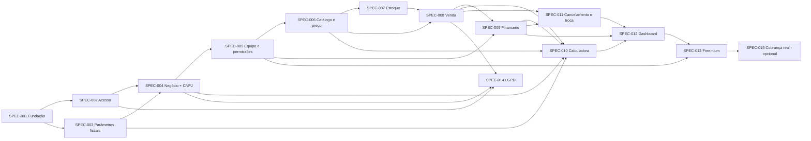

# Mapa de Specs — HealthEnterprise (HE)

> **Status:** ✅ **Aprovado pela equipe em 02/10/2026** (revisão 2 — escolhas de ordenação confirmadas, inconsistências corrigidas e questões em aberto decididas, seção 1.7). **Revisão 3 (03/10/2026):** revisão de consistência da baseline antes da implementação, com as decisões OPEN-12 a OPEN-31 (seção 1.8) — **aguardando revisão do grupo**. As Specs individuais serão geradas uma por vez, sob pedido. Gerado conforme `docs/Prompt_SDD_Specs.pdf`.
>
> **Baseline utilizada:** `VISAO_DE_NEGOCIO.md`, personas v2, `requisitos.md` (RF01–RF73, RN01–RN29, RNF01–RNF11), `requisitos_ears.md`, modelo de domínio e jornadas, casos de uso, diagramas comportamentais, modelo lógico, `schema.prisma`, drivers arquiteturais, ADR-001 a ADR-006, guia de issues e README.
>
> **Convenção:** a baseline usa **RN** (Regra de Negócio) para o que o prompt chama de **RB**.

---

## 1. Análise da baseline

### 1.1 Principais comportamentos do sistema

1. Acessar o sistema com segurança (cadastro, login, sessão única entre negócios).
2. Cadastrar o negócio com enquadramento fiscal (CNPJ → CNAE → regime/Anexo).
3. Montar a equipe com papéis e permissões.
4. Manter o catálogo de produtos e serviços (com materiais) e definir o preço oficial.
5. Controlar o estoque (entradas, saídas manuais, alertas e mínimo sugerido).
6. Registrar vendas multi-itens com pagamento misto e parcelado, integradas a estoque e financeiro.
7. Gerir o financeiro (caixa, contas a pagar/receber, despesas fixas recorrentes).
8. Calcular o preço sugerido pelo markup completo com imposto do Simples/MEI.
9. Cancelar e trocar vendas com estorno.
10. Acompanhar a saúde financeira (dashboard, semáforo, ponto de equilíbrio, projeção de caixa).
11. Diferenciar plano gratuito e pago.
12. Cumprir a LGPD (consentimento, exportação e exclusão).

### 1.2 Dependências entre comportamentos

`Fundação → Acesso → (Parâmetros fiscais) → Negócio → Equipe → Catálogo → Estoque → Venda → Financeiro → Calculadora → Cancelamento → Dashboard → Freemium / LGPD`

- A **Venda** depende do Catálogo (preço oficial — RN23) e do Estoque (validação estrita — RN06).
- A **Calculadora** depende de vendas registradas (RBT12 e CMV% — RF39, RF62), das despesas fixas (RF48, RF60) e dos parâmetros fiscais (RN17). Sem histórico, ela usa as estimativas do RF50; por isso pode vir depois da Venda sem bloquear o uso do catálogo, já que o preço pode ser definido manualmente (RF64).
- O **Dashboard** consome dados de Venda, Financeiro e Calculadora (PE e CMV%) e depende da regra de exclusão de vendas canceladas (RN25).

### 1.3 Regras de negócio e invariantes centrais

| Invariante | Origem |
|---|---|
| Todo dado operacional pertence a um único negócio e só é acessível por seus membros | RN01, RNF02, ADR-002 |
| Venda nunca é concluída com estoque insuficiente; falha implica rollback total | RF18, RN06, AD-CEN02 |
| Venda concluída = baixa de estoque + lançamento(s)/conta(s), na mesma transação | RN12, AD-RF03 |
| Saldo de caixa só contém valores efetivamente recebidos/pagos | RN14, RN22 |
| RBT12 e faturamento somam vendas não canceladas por competência | RN21, RN25 |
| Preço oficial só existe por confirmação explícita e sempre gera histórico | RN15, RN16, RF64 |
| Soma dos percentuais do markup < 100% | RN19 |
| Venda nunca é apagada; cancelamento reverte estoque, contas e caixa | RN25, RN26 |
| Parâmetros fiscais não ficam em código | RN17, RNF08, ADR-004 |

### 1.4 RNFs transversais

RNF01 (web responsiva), RNF02 (multi-tenant), RNF03 (hash de senha), RNF05 (auditoria), RNF06 (< 2 s no cálculo/RBT12), RNF07 (sessão entre negócios), RNF10 (extensibilidade). Conforme o prompt, **não viram Specs próprias**: são associados às Specs em que se aplicam. A exceção é a fundação técnica (SPEC-001), justificada por ADR-001, ADR-002, AD-C01 e AD-C02.

### 1.5 Restrições e decisões já tomadas

ADR-001 (Next.js App Router + TypeScript), ADR-002 (Prisma + PostgreSQL, multi-tenant lógico por `negocioId`), ADR-003 (Supabase Auth + RBAC no servidor), ADR-004 (parâmetros fiscais em banco, RBT12 por agregação), ADR-005 (motor de precificação determinístico em TS puro), ADR-006 (consulta de CNPJ via adaptador com fallback manual). Também estão decididos: TailwindCSS/shadcn/ui (sem ADR, por ser reversível) e CI no GitHub Actions (Issue #02).

### 1.6 Inconsistências encontradas e corrigidas na baseline

| ID | Inconsistência | Resolução |
|---|---|---|
| INC-01 | Em `drivers-arquiteturais-he.md`, a tabela usava AD-QA02 = auditoria e AD-QA03 = LGPD, mas a seção de cenários usava AD-QA02 = isolamento e AD-QA03 = auditoria | Corrigido seguindo a tabela: cenário de auditoria renumerado para AD-QA02, novo cenário AD-QA03 (LGPD) e isolamento por perfil registrado como **AD-QA06** |
| INC-02 | ADR-003 dizia "Supabase Auth ou solução similar" e a Issue #04 citava Auth.js | **Supabase Auth definitivo** no ADR-003; Auth.js removido da Issue #04 |

### 1.7 Questões em aberto — decididas

| ID | Questão | Decisão | Onde foi registrada |
|---|---|---|---|
| OPEN-01 | Valores fiscais iniciais | Arquivo `docs/prisma_base/parametros_fiscais_seed.json` montado com as faixas dos Anexos I–V (LC 123/2006, redação LC 155/2016), parâmetros do MEI, margens padrão e amostra CNAE → Anexo. **Conferido em 03/10/2026:** faixas corretas e DAS atualizado para o salário mínimo de 2026 | Seed, `requisitos.md` (Próximos Passos) |
| OPEN-02 | Quem mantém os parâmetros fiscais | Arquivo de dados versionado no repositório + comando de carga, sem alterar código nem fazer deploy; tela de administração pós-MVP | ADR-004 |
| OPEN-03 | Provedores de autenticação e CNPJ | Supabase Auth (definitivo) e **BrasilAPI** atrás do adaptador, com tempo limite e fallback manual | ADR-003, ADR-006 |
| OPEN-04 | Hospedagem do banco e backup | **Supabase** (mesmo provedor da autenticação); backup diário automático + dump semanal exportado pela equipe | RNF09 |
| OPEN-05 | Fator R e multi-anexo | **Fator R automático** (folha de salários ÷ RBT12; ≥ 28% → Anexo III, senão V; aviso ao mudar); anexo único por negócio, com aviso sobre a simplificação | RF69, RN24, RN28 |
| OPEN-06 | Margens padrão por categoria | Serviços, Beleza, Saúde e Tecnologia: 32%; Produtos, Alimentação, Vestuário, Casa e Outros: 8% (Lei 9.249/1995, art. 15) | RF36, seed |
| OPEN-07 | Matriz de permissões | **Módulo × ação** (ver, criar, editar, excluir/cancelar) por módulo; os 3 papéis são predefinições; tabela completa na SPEC-005 | RF06, AD-QA06 |
| OPEN-08 | Geração das contas mensais | Rotina agendada diária (Vercel Cron) + conferência ao acessar Financeiro/Dashboard; unicidade por despesa + competência | RF67 |
| OPEN-09 | Fuso horário | Datas em UTC; dia, mês e competência em **America/Sao_Paulo** | RN29 |
| OPEN-10 | Relatórios avançados (plano pago) | Rentabilidade por item, exportação de relatórios (CSV/PDF) e histórico acima de 12 meses (dados nunca apagados) | RF47, RF70, RF71, RN18 |
| OPEN-11 | Gráfico e exportação LGPD | Gráfico: 30 dias por dia, com opção de 12 meses por mês. Exportação LGPD: .zip com JSON + CSV | RF43, RNF04 |

### 1.8 Revisão de consistência da baseline — decisões (03/10/2026)

Antes da implementação, a baseline foi cruzada com o `schema.prisma` em busca de pontos que quebrariam a implementação. As decisões abaixo foram tomadas em entrevista com a equipe e aplicadas nos documentos indicados.

| ID | Questão | Decisão | Onde foi registrada |
|---|---|---|---|
| OPEN-12 | Tabelas filhas sem `negocioId` (`MaterialServico`, `MovimentacaoEstoque`, `HistoricoPreco`, `ItemVenda`, `Pagamento`, `Parcela`) contrariavam o ADR-002/AD-C02 | `negocioId` em **todas** as tabelas operacionais, sempre igual ao do pai | Schema, modelo lógico, ADR-002, AD-C02 |
| OPEN-13 | A API REST automática do Supabase expõe o schema `public` com a chave pública | **RLS ligado em todas as tabelas, sem policies**; o Prisma (papel privilegiado) segue funcionando | ADR-002, RNF02, SPEC-001 |
| OPEN-14 | `Usuario.senha` duplicava a credencial do Supabase Auth | Sem senha local; `Usuario.id` = `auth.users.id` | Schema, ADR-003 |
| OPEN-15 | README e a Issue #01 do guia antigo divergiam na estrutura de pastas; local das Specs indefinido | `src/{app,components,lib,hooks}`, `prisma/`, `test/`; Specs em `docs/specs/` | README, IDENTIDADE_VISUAL, guia de issues, SPEC-001 |
| OPEN-16 | Buraco de centavos entre faixas do Simples (`180000` / `180000.01`) com a busca `rbt12De <= RBT12 < rbt12Ate` | Regra `rbt12De < RBT12 ≤ rbt12Ate` com limites contínuos no seed | RF38, schema, seed, ADR-004, diagrama 1 |
| OPEN-17 | Parâmetros do Fator R no seed sem tabela no schema | Nova tabela `ParametroFatorR` | Schema, seed, ADR-004 |
| OPEN-18 | Autônomo sem CNPJ sem regime tributário | Novo regime **Autônomo**, com Imposto% informado pelo usuário | RF37, RF38, RF59, schema |
| OPEN-19 | Convite de quem ainda não tem conta sem onde ser guardado | Nova tabela `Convite` (pendente/aceito/expirado/cancelado); pendentes contam no limite do gratuito | RF72, RF47, schema |
| OPEN-20 | Movimentação de estoque sem vínculo com a venda (estorno reconstruído pela receita atual do serviço) | `vendaId` na `MovimentacaoEstoque`; o cancelamento devolve exatamente o que foi baixado | Schema, diagrama 4 |
| OPEN-21 | Auditoria: a Issue #12 do guia antigo citava "tabela de Auditoria" via middleware inexistente; AD-QA02 pedia valor anterior/novo | As próprias `MovimentacaoEstoque` (com `saldoAnterior`/`saldoPosterior`) e `HistoricoPreco` são o log, somente inserção | RNF05, AD-QA02, schema |
| OPEN-22 | Imposto do Simples dividia por zero com RBT12 = 0 (negócio novo) | RBT12 proporcional (LC 123/2006, art. 18, § 2º): média dos meses × 12 ou faturamento estimado × 12 | RN21, RF39, diagrama 1 |
| OPEN-23 | Período do RBT12 (janela móvel × lei) | **12 meses anteriores ao mês do cálculo**; Fator R e CMV% usam o mesmo período | RN21, RF39, RF62, RF69 |
| OPEN-24 | Visão citava "Calculadora limitada" e "trial guiado" no gratuito, contra o RF47 | Vale o RF47: Calculadora completa no gratuito, sem trial | Visão §8.1, RF47 |
| OPEN-25 | Como o negócio passa ao plano pago (UC15) sem gateway previsto | Troca **simulada** pelo Dono no MVP (RF73), num único ponto de troca; cobrança real por adaptador (Stripe) na SPEC-015 opcional | RF73, ADR-007 (proposta), SPEC-013, SPEC-015 |
| OPEN-26 | Guia de issues agrupava o trabalho diferente das Specs | Reescrito com **uma issue por Spec** | Guia de issues |
| OPEN-27 | Ambientes de publicação não definidos (OPEN-007 da SPEC-001) | Desenvolvimento, preview por PR, homologação (`DEVELOP`) e produção (`main`), cada um com banco e credenciais próprios; produção pronta para ativar | RNF11, AD-C05, README, SPEC-001 |
| OPEN-28 | Mecanismo do "cliente do negócio" (OPEN-002 da SPEC-001) | Extensão do Prisma Client | ADR-002, SPEC-001 |
| OPEN-29 | Plano gratuito do Supabase sem backup diário restaurável (OPEN-003 da SPEC-001) | Dump diário via GitHub Actions; backup nativo do plano pago quando for para produção | RNF09, SPEC-001 |
| OPEN-30 | Fonte da verdade do schema após a SPEC-001 (OPEN-005 da SPEC-001) | `prisma/schema.prisma`; a cópia em `docs/prisma_base/` é removida na implementação da SPEC-001, com aviso do novo local | SPEC-001 |
| OPEN-31 | Ferramenta de testes (OPEN-006 da SPEC-001) | Vitest | README, ADRs (sem ADR), SPEC-001 |

Também foram corrigidos, sem decisão nova: a ordem do cronograma da Visão (Calculadora depois de Vendas e Financeiro), o nome do campo de plano no guia de issues (`plano_pago` → enum `plano`), o modelo lógico desatualizado em relação ao schema, o diagrama da calculadora sem o Fator R e o uso de `SELECT ... FOR UPDATE` (não suportado diretamente pelo Prisma) no diagrama de venda, substituído por baixa condicional atômica.

**Escolhas de ordenação confirmadas pela equipe:** (1) a Calculadora permanece depois da Venda e do Financeiro, com preço manual (RF64) disponível antes; (2) os RNFs ficam distribuídos pelas Specs, e apenas a fundação técnica é Spec própria.

---

## 2. Mapa ordenado de Specs

### 2.1 Visão geral

| ID | Nome | Depende de |
|---|---|---|
| SPEC-001 | Fundação técnica e isolamento multi-tenant | — |
| SPEC-002 | Acesso: cadastro, login e consentimento | 001 |
| SPEC-003 | Parâmetros fiscais oficiais | 001 |
| SPEC-004 | Cadastro do negócio e enquadramento fiscal | 002, 003 |
| SPEC-005 | Equipe, papéis e permissões | 004 |
| SPEC-006 | Catálogo de itens e preço oficial | 005 |
| SPEC-007 | Estoque: movimentações, alertas e mínimo sugerido | 006 |
| SPEC-008 | Registro de venda integrado | 006, 007 |
| SPEC-009 | Financeiro: caixa, contas e despesas fixas | 005, 008 |
| SPEC-010 | Calculadora de precificação | 003, 004, 006, 008, 009 |
| SPEC-011 | Cancelamento e troca de venda | 008, 009 |
| SPEC-012 | Dashboard e saúde financeira | 009, 010, 011 |
| SPEC-013 | Plano gratuito × pago | 005, 012 |
| SPEC-014 | LGPD: exportação e exclusão de conta | 002, 004, 008 |
| SPEC-015 *(opcional)* | Cobrança real do plano pago | 013 |

### 2.2 Detalhamento

#### SPEC-001 — Fundação técnica e isolamento multi-tenant
- **Spec:** [`specs/SPEC-001.md`](./specs/SPEC-001.md) (✅ aprovada e implementada — PR #36)
- **Objetivo:** estabelecer o projeto Next.js + TypeScript, o Prisma conectado ao PostgreSQL com o schema da baseline, o mecanismo obrigatório de filtro por `negocioId` e o pipeline de CI (lint, `prisma validate`, testes).
- **Valor entregue:** base única e segura para todas as Specs; vazamento entre negócios impedido por construção.
- **RF:** — · **RN:** RN01, RN29 (datas em UTC e competência em America/Sao_Paulo) · **RNF:** RNF01, RNF02 (inclui RLS — OPEN-13), RNF09 (dump diário — OPEN-29), RNF10, RNF11 (ambientes — OPEN-27)
- **Caso de uso / fluxo:** — (Spec técnica; Issue #01)
- **Entidades:** Negocio (base de tenant); demais entidades apenas como schema
- **Drivers:** AD-C01, AD-C02, AD-C03, AD-C05, AD-QA06 · **ADRs:** ADR-001, ADR-002
- **Dependências:** nenhuma
- **Justificativa da ordem:** decisão estrutural exigida por ADR-001/002 e AD-C02; toda Spec posterior depende dela.

#### SPEC-002 — Acesso: cadastro, login e consentimento
- **Spec:** [`specs/SPEC-002.md`](./specs/SPEC-002.md) (✅ aprovada — questões em aberto decididas)
- **Objetivo:** permitir cadastro e login por e-mail e senha, com consentimento LGPD explícito e senha protegida.
- **Valor entregue:** o usuário passa a ter uma conta segura no sistema.
- **RF:** RF01 · **RN:** — · **RNF:** RNF03, RNF04 (consentimento), RNF07 (sessão)
- **Caso de uso / fluxo:** UC1 Autenticar-se; jornadas (Tela de Login)
- **Entidades:** Usuario
- **Drivers:** AD-RF02, AD-QA03 · **ADRs:** ADR-003
- **Dependências:** SPEC-001
- **Justificativa da ordem:** nenhuma ação de negócio existe sem um usuário autenticado.

#### SPEC-003 — Parâmetros fiscais oficiais
- **Objetivo:** disponibilizar, como configuração (não código), as faixas do Simples por Anexo, a tabela CNAE → Anexo, os parâmetros do MEI (DAS e limite) e as margens padrão por categoria, com fonte legal e vigência.
- **Valor entregue:** enquadramento e cálculo de imposto corretos e atualizáveis sem deploy.
- **RF:** RF36 (dados das margens padrão) · **RN:** RN17 · **RNF:** RNF08
- **Caso de uso / fluxo:** — (insumo dos fluxos de cadastro do negócio e da calculadora)
- **Entidades:** FaixaTributaria, CnaeAnexo (com `sujeitoFatorR`), ParametroMei, ParametroFatorR, MargemPadraoCategoria
- **Drivers:** AD-RF04 · **ADRs:** ADR-004
- **Dependências:** SPEC-001
- **Justificativa da ordem:** a SPEC-004 precisa da tabela CNAE → Anexo, e a SPEC-010 precisa das faixas, do DAS, das margens e da regra do Fator R. Os dados vêm de `docs/prisma_base/parametros_fiscais_seed.json`, carregados por comando de carga (ADR-004). **Pré-requisito:** conferência dos valores do seed — concluída em 03/10/2026.

#### SPEC-004 — Cadastro do negócio e enquadramento fiscal
- **Objetivo:** criar negócios por CNPJ (consulta à BrasilAPI com fallback manual) ou no regime Autônomo (sem CNPJ, com Imposto% informado), sugerir Anexo/atividade MEI pelo CNAE e alternar entre negócios sem novo login.
- **Valor entregue:** o empreendedor tem seu negócio configurado fiscalmente sem precisar conhecer o próprio enquadramento.
- **RF:** RF02, RF03, RF58, RF59 · **RN:** RN24 · **RNF:** RNF02, RNF07
- **Caso de uso / fluxo:** UC0 Cadastrar Negócio, UC2 Alternar entre Negócios; jornada do Dono (B1–B5)
- **Entidades:** Negocio, MembroNegocio (Dono), CnaeAnexo
- **Drivers:** AD-RF05, AD-C02 · **ADRs:** ADR-002, ADR-006
- **Dependências:** SPEC-002, SPEC-003
- **Justificativa da ordem:** o negócio é o tenant de todos os dados seguintes. Registra se o CNAE é sujeito ao Fator R, usado depois pela SPEC-010.

#### SPEC-005 — Equipe, papéis e permissões
- **Spec:** [`specs/SPEC-005.md`](./specs/SPEC-005.md) (✅ aprovada — questões em aberto decididas em 07/10/2026)
- **Objetivo:** convidar colaboradores (inclusive quem ainda não tem conta), atribuir os papéis Dono/Gerente/Colaborador e permissões granulares, validadas no servidor, respeitando o limite de 1 colaborador (membro ou convite pendente) no plano gratuito.
- **Valor entregue:** o dono delega a operação sem expor dados estratégicos (persona Lucas).
- **RF:** RF04, RF05, RF06, RF47 (limite de convites), RF72 · **RN:** RN01, RN02 · **RNF:** RNF02
- **Caso de uso / fluxo:** UC3 Convidar Colaborador, UC4 Definir Permissões; jornadas do Gerente e do Colaborador
- **Entidades:** MembroNegocio, Convite, Usuario, Negocio (plano)
- **Drivers:** AD-RF02, AD-QA06 · **ADRs:** ADR-003
- **Dependências:** SPEC-004
- **Justificativa da ordem:** as guardas de papel e a matriz módulo × ação são pré-condição de todos os módulos operacionais.

#### SPEC-006 — Catálogo de itens e preço oficial
- **Objetivo:** cadastrar produtos físicos e serviços (com materiais vinculados, categoria, unidade e comissão opcional) e definir o preço oficial manualmente, sempre com histórico.
- **Valor entregue:** catálogo único do negócio, base para estoque, vendas e precificação.
- **RF:** RF07–RF14, RF41, RF52, RF64 · **RN:** RN03, RN04, RN15, RN16 · **RNF:** RNF05 (auditoria de preço)
- **Caso de uso / fluxo:** UC5, UC6, UC6a, UC10b (histórico); jornada do Dono (D1–D8)
- **Entidades:** Item (ProdutoFisico/Servico), Categoria, MaterialServico, HistoricoPreco
- **Drivers:** AD-RF01, AD-CEN01, AD-QA02 · **ADRs:** ADR-002
- **Dependências:** SPEC-005
- **Justificativa da ordem:** estoque, vendas e calculadora operam sobre itens. O preço manual (RF64) permite vender antes da calculadora existir.

#### SPEC-007 — Estoque: movimentações, alertas e mínimo sugerido
- **Objetivo:** registrar entradas e saídas manuais (com motivo), manter auditoria imutável na própria movimentação (saldo anterior e posterior), sugerir o estoque mínimo e alertar quando o estoque estiver baixo.
- **Valor entregue:** o estoque digital reflete o físico e a reposição é antecipada.
- **RF:** RF15, RF17, RF19, RF20, RF21 · **RN:** RN07, RN08 · **RNF:** RNF05
- **Caso de uso / fluxo:** UC7, UC8, UC9; jornadas do Dono e do Colaborador (Estoque)
- **Entidades:** Item, MovimentacaoEstoque, Negocio (dias de cobertura)
- **Drivers:** AD-QA02 · **ADRs:** ADR-002
- **Dependências:** SPEC-006
- **Justificativa da ordem:** a venda (SPEC-008) só pode validar e baixar estoque que já é controlado.

#### SPEC-008 — Registro de venda integrado
- **Objetivo:** registrar vendas multi-itens com cliente opcional e pagamento misto/parcelado, validando estoque (baixa condicional atômica) e preço; dar baixa no estoque (incluindo materiais, com movimentações ligadas à venda) e gerar lançamentos ou contas a receber na mesma transação, gravando o custo unitário.
- **Valor entregue:** o fluxo central de operação, integrado ao estoque e ao financeiro sem lançamento duplicado.
- **RF:** RF16, RF18, RF22–RF28, RF33, RF62 (gravação do custo unitário) · **RN:** RN05, RN06, RN09–RN13, RN23, RN29 · **RNF:** RNF01, RNF02
- **Caso de uso / fluxo:** UC11, UC11a–d; Diagrama 2 (sequência de venda); jornadas (Nova Venda)
- **Entidades:** Venda, ItemVenda, Pagamento, Parcela, Cliente, MovimentacaoEstoque, LancamentoFinanceiro, ContaPagarReceber
- **Drivers:** AD-RF03, AD-CEN01, AD-CEN02 · **ADRs:** ADR-002, ADR-003
- **Dependências:** SPEC-006, SPEC-007
- **Justificativa da ordem:** gera os dados de que o financeiro, a calculadora (RBT12 e CMV%) e o dashboard dependem.

#### SPEC-009 — Financeiro: caixa, contas e despesas fixas
- **Objetivo:** manter o fluxo de caixa e as contas a pagar/receber (com quitação parcial que gera lançamento), cadastrar as despesas fixas (incluindo o DAS do MEI) e gerar suas contas mensais.
- **Valor entregue:** saldo real e compromissos futuros visíveis, sem lançamento duplicado.
- **RF:** RF06 (permissão de despesa operacional), RF29–RF32, RF48, RF60, RF67 · **RN:** RN14, RN22 · **RNF:** RNF02, RNF05
- **Caso de uso / fluxo:** UC12, UC12a, UC13, UC16; Diagrama 3 (estados da conta)
- **Entidades:** LancamentoFinanceiro, ContaPagarReceber, Parcela, DespesaFixa, ParametroMei
- **Drivers:** AD-RF01, AD-RF03 · **ADRs:** ADR-002
- **Dependências:** SPEC-005, SPEC-008
- **Justificativa da ordem:** recebe as contas geradas pelas vendas e fornece as despesas fixas (com contas mensais geradas por rotina diária + conferência ao acessar) para a calculadora e o dashboard.

#### SPEC-010 — Calculadora de precificação
- **Objetivo:** sugerir o preço de venda pelo markup completo (custo + materiais, despesas fixas %, despesas variáveis %, imposto por RBT12 — 12 meses anteriores, proporcional com pouco histórico — e Anexo efetivo — com Fator R —, ou Imposto% informado no regime Autônomo, margem), exibir o ponto de equilíbrio e confirmar o preço oficial com histórico.
- **Valor entregue:** o diferencial central do produto — precificação correta e auditável.
- **RF:** RF34–RF40, RF41, RF49, RF50, RF51, RF53, RF54, RF55 (cálculo do PE), RF60 (Imposto% = 0 para MEI), RF61, RF62 (cálculo do CMV%), RF69 · **RN:** RN15, RN16, RN19, RN20, RN21, RN28, RN29 · **RNF:** RNF05, RNF06, RNF08
- **Caso de uso / fluxo:** UC10, UC10a, UC10b, UC16 (parâmetros de precificação); Diagrama 1 (sequência da calculadora)
- **Entidades:** Item, MaterialServico, HistoricoPreco, Negocio (parâmetros), DespesaFixa, FaixaTributaria, ParametroMei, ParametroFatorR, MargemPadraoCategoria, Venda/ItemVenda (RBT12 e CMV%)
- **Drivers:** AD-RF04, AD-QA01 · **ADRs:** ADR-004, ADR-005
- **Dependências:** SPEC-003, SPEC-004, SPEC-006, SPEC-008, SPEC-009
- **Justificativa da ordem:** precisa de vendas (RBT12 e CMV%), de despesas fixas e lançamentos de salário (Fator R) e de parâmetros fiscais já estabelecidos.

#### SPEC-011 — Cancelamento e troca de venda
- **Objetivo:** cancelar uma venda com motivo, revertendo estoque (exatamente as movimentações da venda), contas abertas e valores recebidos em uma transação; opcionalmente, fazer a troca por itens de valor menor ou igual, com crédito de troca.
- **Valor entregue:** correção de erros e devoluções sem corromper estoque, caixa ou faturamento.
- **RF:** RF65, RF66 · **RN:** RN25, RN26 · **RNF:** RNF05
- **Caso de uso / fluxo:** UC18; Diagrama 4 (sequência de cancelamento e troca)
- **Entidades:** Venda, ItemVenda, Pagamento, MovimentacaoEstoque, ContaPagarReceber, LancamentoFinanceiro, Usuario
- **Drivers:** AD-CEN03, AD-RF03 · **ADRs:** ADR-002, ADR-003
- **Dependências:** SPEC-008, SPEC-009
- **Justificativa da ordem:** só pode reverter efeitos (contas e lançamentos) já estabelecidos; precisa vir antes do dashboard, que exclui vendas canceladas.

#### SPEC-012 — Dashboard e saúde financeira
- **Objetivo:** exibir o resumo do dia, o gráfico de vendas, o semáforo (PE × meta) e a projeção de caixa para Dono e Gerente, e o dashboard restrito para o Colaborador.
- **Valor entregue:** visão imediata da saúde do negócio — a proposta "visual e sob controle".
- **RF:** RF42, RF43, RF44, RF56, RF57, RF63, RF68 · **RN:** RN21, RN25 (consumo), RN29 · **RNF:** RNF01, RNF06, RNF10
- **Caso de uso / fluxo:** UC14, UC17, UC19; jornadas (Dashboard / Dashboard restrito)
- **Entidades:** Venda, LancamentoFinanceiro, ContaPagarReceber, DespesaFixa, Negocio (margem meta)
- **Drivers:** AD-QA01, AD-QA04 · **ADRs:** ADR-001, ADR-005
- **Dependências:** SPEC-009, SPEC-010, SPEC-011
- **Justificativa da ordem:** agrega dados de todos os módulos anteriores.

#### SPEC-013 — Plano gratuito × pago
- **Objetivo:** diferenciar as funcionalidades por plano (sem limite de volume), entregar os relatórios avançados do plano pago (rentabilidade por item, exportação CSV/PDF, histórico acima de 12 meses), bloqueá-los no gratuito e oferecer o upgrade, com troca de plano simulada pelo Dono num único ponto de troca (`alterarPlano`), preparado para a cobrança real (SPEC-015).
- **Valor entregue:** viabiliza o modelo freemium sem afastar o público sensível a preço.
- **RF:** RF45, RF46, RF47 (relatórios avançados), RF70, RF71, RF73 · **RN:** RN18 · **RNF:** RNF10
- **Caso de uso / fluxo:** UC15 Gerenciar Plano do Negócio
- **Entidades:** Negocio (plano), MembroNegocio, Venda/ItemVenda (rentabilidade), LancamentoFinanceiro, ContaPagarReceber (exportação)
- **Drivers:** AD-QA05 · **ADRs:** ADR-003
- **Dependências:** SPEC-005, SPEC-012
- **Justificativa da ordem:** precisa que as funcionalidades a restringir e os dados dos relatórios já existam.

#### SPEC-014 — LGPD: exportação e exclusão de conta
- **Objetivo:** exportar os dados do titular (.zip com JSON e CSV) e excluir a conta por anonimização, encerrando os negócios em que ele é o único Dono e mantendo os registros fiscais por 5 anos sem identificação.
- **Valor entregue:** conformidade legal e confiança do usuário.
- **RF:** — · **RN:** RN27 · **RNF:** RNF04
- **Caso de uso / fluxo:** — (Issue #14)
- **Entidades:** Usuario, Cliente, Negocio, MembroNegocio
- **Drivers:** AD-QA03 · **ADRs:** ADR-003
- **Dependências:** SPEC-002, SPEC-004, SPEC-008
- **Inclui também (SPEC-005, OPEN-009):** apagar o e-mail dos convites expirados ou cancelados há mais de 90 dias.
- **Justificativa da ordem:** a anonimização precisa cobrir usuários, negócios e clientes (criados nas vendas). Pode ser feita em paralelo à SPEC-009 em diante.

#### SPEC-015 — Cobrança real do plano pago *(opcional)*
- **Objetivo:** substituir a troca de plano simulada pela cobrança de assinatura via gateway (Stripe), com checkout hospedado, portal do cliente, webhooks verificados e idempotentes e período de tolerância na inadimplência.
- **Valor entregue:** o modelo freemium passa a gerar receita real; em dev e homologação roda sempre em modo de teste.
- **RF:** RF73 (troca de plano pelo gateway) · **RN:** RN18 · **RNF:** RNF10, RNF11
- **Caso de uso / fluxo:** UC15 Gerenciar Plano do Negócio
- **Entidades:** Negocio (plano e dados da assinatura no gateway)
- **Drivers:** AD-QA05, AD-C05 · **ADRs:** ADR-007 (proposta — aprovar antes de gerar a Spec)
- **Dependências:** SPEC-013
- **Justificativa da ordem:** fora do caminho crítico do MVP; só substitui o ponto de troca de plano criado na SPEC-013. Feita se sobrar tempo no semestre ou na continuação rumo à produção.

---

## 3. Cobertura da baseline

Todos os 113 requisitos (RF01–RF73, RN01–RN29, RNF01–RNF11) estão associados a pelo menos uma Spec. Requisitos compartilhados aparecem em mais de uma Spec com escopos complementares:

| Requisito | Specs | Divisão |
|---|---|---|
| RF06 | 005, 009 | Mecanismo de permissões (005); permissão de despesa operacional (009) |
| RF36 | 003, 010 | Dados das margens padrão (003); sugestão na calculadora (010) |
| RF41 / RN15 / RN16 | 006, 010 | Histórico por preço manual (006); por confirmação da calculadora (010) |
| RF47 | 005, 013 | Limite de convites (005); relatórios avançados (013) |
| RF60 | 009, 010 | DAS como despesa fixa e conta mensal (009); Imposto% = 0 no markup (010) |
| RF62 | 008, 010 | Gravação do custo unitário na venda (008); cálculo do CMV% (010) |
| RN21 / RN25 | 010–012 | Regra aplicada nas agregações de cada Spec |
| RN29 | 001, 008, 010, 012 | Utilitário de datas (001); aplicado nas vendas do dia, RBT12, competência e gráficos |
| RF73 | 013, 015 | Troca de plano simulada (013); troca pelo gateway de pagamento (015, opcional) |
| RNF11 | 001, 015 | Ambientes e variáveis por ambiente (001); chaves de teste × produção do gateway (015) |

---

## 4. Próximo passo

**Mapa aprovado.** Cada Spec será gerada **individualmente**, sob pedido ("Gerar SPEC-XXX"), seguindo as 14 seções do prompt complementar, sem implementação no mesmo pedido.

A conferência do seed fiscal foi concluída em 03/10/2026 (DAS do MEI atualizado para o salário mínimo de 2026), e a SPEC-003 não tem mais pré-requisito pendente. A SPEC-015 depende da aprovação do ADR-007.

**Andamento:** [SPEC-001](specs/SPEC-001.md) e [SPEC-002](specs/SPEC-002.md) implementadas e verificadas na homologação. [SPEC-003](specs/SPEC-003.md) implementada e verificada na homologação. [SPEC-004](specs/SPEC-004.md) implementada e verificada no preview da Vercel (04/10/2026). [SPEC-005](specs/SPEC-005.md) aprovada (07/10/2026), aguardando implementação.
