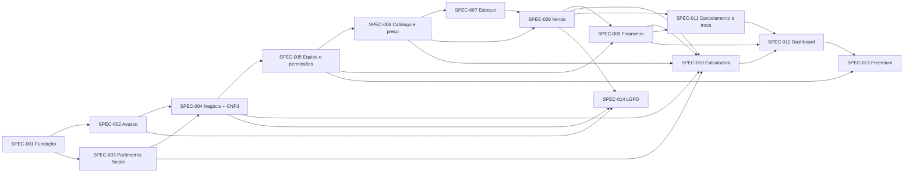

# Mapa de Specs — HealthEnterprise (HE)

> **Status:** proposta aguardando aprovação humana. Gerado conforme `docs/Prompt_SDD_Specs.pdf` (etapa 1, decomposição). Nenhuma Spec individual foi escrita e nenhum código foi gerado.
>
> **Baseline utilizada:** `VISAO_DE_NEGOCIO.md`, personas v2, `requisitos.md` (RF01–RF68, RN01–RN27, RNF01–RNF10), `requisitos_ears.md`, modelo de domínio e jornadas, casos de uso, diagramas comportamentais, modelo lógico, `schema.prisma`, drivers arquiteturais, ADR-001 a ADR-006, guia de issues e README.
>
> **Convenção:** a baseline usa **RN** (Regra de Negócio) para o que o prompt chama de **RB**.

---

## 1. Análise da baseline

### 1.1 Principais comportamentos do sistema

1. Acessar o sistema com segurança (cadastro, login, sessão única entre negócios).
2. Cadastrar o negócio com enquadramento fiscal (CNPJ → CNAE → regime/Anexo).
3. Montar a equipe com papéis e permissões.
4. Manter o catálogo de produtos e serviços (com materiais) e definir o preço oficial.
5. Controlar o estoque (entradas, saídas manuais, alertas e mínimo sugerido).
6. Registrar vendas multi-itens com pagamento misto e parcelado, integradas a estoque e financeiro.
7. Gerir o financeiro (caixa, contas a pagar/receber, despesas fixas recorrentes).
8. Calcular o preço sugerido pelo markup completo com imposto do Simples/MEI.
9. Cancelar e trocar vendas com estorno.
10. Acompanhar a saúde financeira (dashboard, semáforo, ponto de equilíbrio, projeção de caixa).
11. Diferenciar plano gratuito e pago.
12. Cumprir a LGPD (consentimento, exportação e exclusão).

### 1.2 Dependências entre comportamentos

`Fundação → Acesso → (Parâmetros fiscais) → Negócio → Equipe → Catálogo → Estoque → Venda → Financeiro → Calculadora → Cancelamento → Dashboard → Freemium / LGPD`

- A **Venda** depende do Catálogo (preço oficial — RN23) e do Estoque (validação estrita — RN06).
- A **Calculadora** depende de vendas registradas (RBT12 e CMV% — RF39, RF62), das despesas fixas (RF48, RF60) e dos parâmetros fiscais (RN17). Sem histórico, ela usa as estimativas do RF50; por isso pode vir depois da Venda sem bloquear o uso do catálogo, já que o preço pode ser definido manualmente (RF64).
- O **Dashboard** consome dados de Venda, Financeiro e Calculadora (PE e CMV%) e depende da regra de exclusão de vendas canceladas (RN25).

### 1.3 Regras de negócio e invariantes centrais

| Invariante | Origem |
|---|---|
| Todo dado operacional pertence a um único negócio e só é acessível por seus membros | RN01, RNF02, ADR-002 |
| Venda nunca é concluída com estoque insuficiente; falha implica rollback total | RF18, RN06, AD-CEN02 |
| Venda concluída = baixa de estoque + lançamento(s)/conta(s), na mesma transação | RN12, AD-RF03 |
| Saldo de caixa só contém valores efetivamente recebidos/pagos | RN14, RN22 |
| RBT12 e faturamento somam vendas não canceladas por competência | RN21, RN25 |
| Preço oficial só existe por confirmação explícita e sempre gera histórico | RN15, RN16, RF64 |
| Soma dos percentuais do markup < 100% | RN19 |
| Venda nunca é apagada; cancelamento reverte estoque, contas e caixa | RN25, RN26 |
| Parâmetros fiscais não ficam em código | RN17, RNF08, ADR-004 |

### 1.4 RNFs transversais

RNF01 (web responsiva), RNF02 (multi-tenant), RNF03 (hash de senha), RNF05 (auditoria), RNF06 (< 2 s no cálculo/RBT12), RNF07 (sessão entre negócios), RNF10 (extensibilidade). Conforme o prompt, **não viram Specs próprias**: são associados às Specs em que se aplicam. A exceção é a fundação técnica (SPEC-001), justificada por ADR-001, ADR-002, AD-C01 e AD-C02.

### 1.5 Restrições e decisões já tomadas

ADR-001 (Next.js App Router + TypeScript), ADR-002 (Prisma + PostgreSQL, multi-tenant lógico por `negocioId`), ADR-003 (Supabase Auth + RBAC no servidor), ADR-004 (parâmetros fiscais em banco, RBT12 por agregação), ADR-005 (motor de precificação determinístico em TS puro), ADR-006 (consulta de CNPJ via adaptador com fallback manual). Também estão decididos: TailwindCSS/shadcn/ui (sem ADR, por ser reversível) e CI no GitHub Actions (Issue #02).

### 1.6 Inconsistências encontradas na baseline (não corrigidas aqui)

- **INC-01** — Em `drivers-arquiteturais-he.md`, a tabela de drivers e a matriz de rastreabilidade definem **AD-QA02 = auditoria imutável (RNF05)** e **AD-QA03 = LGPD (RNF04)**, mas a seção 5 (cenários de qualidade) usa **AD-QA02 = isolamento por perfil** e **AD-QA03 = auditoria**. Neste mapa vale a numeração da tabela/matriz. **Ação proposta:** corrigir a seção 5 após aprovação.
- **INC-02** — O ADR-003 decide por "Supabase Auth **ou solução similar**" e rejeita Auth.js como alternativa, mas a Issue #04 do guia ainda diz "Supabase Auth (ou Auth.js)". **Ação proposta:** remover "ou Auth.js" da Issue #04, ou registrar a decisão final em OPEN-03.

### 1.7 Questões em aberto (OPEN-XX)

- **OPEN-01** — Valores fiscais oficiais iniciais: faixas e parcelas a deduzir dos Anexos I–V, tabela CNAE → Anexo (completa ou parcial no MVP), valor do DAS por atividade e limite anual do MEI. *Bloqueia a conclusão da SPEC-003.*
- **OPEN-02** — Quem mantém os parâmetros fiscais? O RN17 exige atualização sem alterar código, mas não existe papel de **administrador do sistema** (o RF05 só define Dono, Gerente e Colaborador). *Afeta a SPEC-003.*
- **OPEN-03** — Provedor definitivo de autenticação (ver INC-02) e provedor da consulta de CNPJ (o ADR-006 cita BrasilAPI só como exemplo): limites de uso e indisponibilidade. *Afeta as SPEC-002 e SPEC-004.*
- **OPEN-04** — Hospedagem do banco (Supabase ou Neon) e mecanismo/frequência de backup (RNF09). *Afeta a SPEC-001.*
- **OPEN-05** — Fator R (Anexo III × V) e negócios com receitas de anexos diferentes; o MVP usa um anexo por negócio (RN24). *Afeta as SPEC-004 e SPEC-010.*
- **OPEN-06** — Validação do mapeamento categoria → percentual de presunção para as margens padrão (RF36). *Afeta as SPEC-003 e SPEC-010.*
- **OPEN-07** — Matriz de permissões granulares por módulo (RF06): quais ações cada módulo expõe para liberação individual. *Afeta a SPEC-005.*
- **OPEN-08** — Mecanismo de geração mensal das contas de despesas fixas (RF67): rotina agendada ou geração idempotente ao acessar o Financeiro. *Afeta a SPEC-009.*
- **OPEN-09** — Fuso horário de referência para "dia", "mês" e competência (vendas do dia, RBT12, semáforo). Sugestão a validar: America/Sao_Paulo. *Afeta as SPEC-008, SPEC-010 e SPEC-012.*
- **OPEN-10** — O que são os "relatórios avançados" exclusivos do plano pago (RF47). *Afeta a SPEC-013.*
- **OPEN-11** — Período do gráfico de vendas (RF43: "últimos dias/mês") e formato da exportação LGPD (JSON, CSV ou ambos). *Afeta as SPEC-012 e SPEC-014.*

---

## 2. Mapa ordenado de Specs

### 2.1 Visão geral

| ID | Nome | Depende de |
|---|---|---|
| SPEC-001 | Fundação técnica e isolamento multi-tenant | — |
| SPEC-002 | Acesso: cadastro, login e consentimento | 001 |
| SPEC-003 | Parâmetros fiscais oficiais | 001 |
| SPEC-004 | Cadastro do negócio e enquadramento fiscal | 002, 003 |
| SPEC-005 | Equipe, papéis e permissões | 004 |
| SPEC-006 | Catálogo de itens e preço oficial | 005 |
| SPEC-007 | Estoque: movimentações, alertas e mínimo sugerido | 006 |
| SPEC-008 | Registro de venda integrado | 006, 007 |
| SPEC-009 | Financeiro: caixa, contas e despesas fixas | 005, 008 |
| SPEC-010 | Calculadora de precificação | 003, 004, 006, 008, 009 |
| SPEC-011 | Cancelamento e troca de venda | 008, 009 |
| SPEC-012 | Dashboard e saúde financeira | 009, 010, 011 |
| SPEC-013 | Plano gratuito × pago | 005, 012 |
| SPEC-014 | LGPD: exportação e exclusão de conta | 002, 004, 008 |

### 2.2 Detalhamento

#### SPEC-001 — Fundação técnica e isolamento multi-tenant
- **Objetivo:** estabelecer o projeto Next.js + TypeScript, o Prisma conectado ao PostgreSQL com o schema da baseline, o mecanismo obrigatório de filtro por `negocioId` e o pipeline de CI (lint, `prisma validate`, testes).
- **Valor entregue:** base única e segura para todas as Specs; vazamento entre negócios impedido por construção.
- **RF:** — · **RN:** RN01 · **RNF:** RNF01, RNF02, RNF09, RNF10
- **Caso de uso / fluxo:** — (Spec técnica; Issues #01 e #02)
- **Entidades:** Negocio (base de tenant); demais entidades apenas como schema
- **Drivers:** AD-C01, AD-C02, AD-C03 · **ADRs:** ADR-001, ADR-002
- **Dependências:** nenhuma
- **Justificativa da ordem:** decisão estrutural exigida por ADR-001/002 e AD-C02; toda Spec posterior depende dela.

#### SPEC-002 — Acesso: cadastro, login e consentimento
- **Objetivo:** permitir cadastro e login por e-mail e senha, com consentimento LGPD explícito e senha protegida.
- **Valor entregue:** o usuário passa a ter uma conta segura no sistema.
- **RF:** RF01 · **RN:** — · **RNF:** RNF03, RNF04 (consentimento), RNF07 (sessão)
- **Caso de uso / fluxo:** UC1 Autenticar-se; jornadas (Tela de Login)
- **Entidades:** Usuario
- **Drivers:** AD-RF02, AD-QA03 · **ADRs:** ADR-003
- **Dependências:** SPEC-001
- **Justificativa da ordem:** nenhuma ação de negócio existe sem um usuário autenticado.

#### SPEC-003 — Parâmetros fiscais oficiais
- **Objetivo:** disponibilizar, como configuração (não código), as faixas do Simples por Anexo, a tabela CNAE → Anexo, os parâmetros do MEI (DAS e limite) e as margens padrão por categoria, com fonte legal e vigência.
- **Valor entregue:** enquadramento e cálculo de imposto corretos e atualizáveis sem deploy.
- **RF:** RF36 (dados das margens padrão) · **RN:** RN17 · **RNF:** RNF08
- **Caso de uso / fluxo:** — (insumo dos fluxos de cadastro do negócio e da calculadora)
- **Entidades:** FaixaTributaria, CnaeAnexo, ParametroMei, MargemPadraoCategoria
- **Drivers:** AD-RF04 · **ADRs:** ADR-004
- **Dependências:** SPEC-001
- **Justificativa da ordem:** a SPEC-004 precisa da tabela CNAE → Anexo, e a SPEC-010 precisa das faixas, do DAS e das margens. **Bloqueada parcialmente por OPEN-01, OPEN-02 e OPEN-06.**

#### SPEC-004 — Cadastro do negócio e enquadramento fiscal
- **Objetivo:** criar negócios por CNPJ (consulta pública com fallback manual), sugerir Anexo/atividade MEI pelo CNAE e alternar entre negócios sem novo login.
- **Valor entregue:** o empreendedor tem seu negócio configurado fiscalmente sem precisar conhecer o próprio enquadramento.
- **RF:** RF02, RF03, RF58, RF59 · **RN:** RN24 · **RNF:** RNF02, RNF07
- **Caso de uso / fluxo:** UC0 Cadastrar Negócio, UC2 Alternar entre Negócios; jornada do Dono (B1–B5)
- **Entidades:** Negocio, MembroNegocio (Dono), CnaeAnexo
- **Drivers:** AD-RF05, AD-C02 · **ADRs:** ADR-002, ADR-006
- **Dependências:** SPEC-002, SPEC-003
- **Justificativa da ordem:** o negócio é o tenant de todos os dados seguintes. **Afetada por OPEN-03 e OPEN-05.**

#### SPEC-005 — Equipe, papéis e permissões
- **Objetivo:** convidar colaboradores, atribuir os papéis Dono/Gerente/Colaborador e permissões granulares, validadas no servidor, respeitando o limite de 1 convidado no plano gratuito.
- **Valor entregue:** o dono delega a operação sem expor dados estratégicos (persona Lucas).
- **RF:** RF04, RF05, RF06, RF47 (limite de convites) · **RN:** RN01, RN02 · **RNF:** RNF02
- **Caso de uso / fluxo:** UC3 Convidar Colaborador, UC4 Definir Permissões; jornadas do Gerente e do Colaborador
- **Entidades:** MembroNegocio, Usuario, Negocio (plano)
- **Drivers:** AD-RF02 · **ADRs:** ADR-003
- **Dependências:** SPEC-004
- **Justificativa da ordem:** as guardas de papel são pré-condição de todos os módulos operacionais. **Afetada por OPEN-07.**

#### SPEC-006 — Catálogo de itens e preço oficial
- **Objetivo:** cadastrar produtos físicos e serviços (com materiais vinculados, categoria, unidade e comissão opcional) e definir o preço oficial manualmente, sempre com histórico.
- **Valor entregue:** catálogo único do negócio, base para estoque, vendas e precificação.
- **RF:** RF07–RF14, RF41, RF52, RF64 · **RN:** RN03, RN04, RN15, RN16 · **RNF:** RNF05 (auditoria de preço)
- **Caso de uso / fluxo:** UC5, UC6, UC6a, UC10b (histórico); jornada do Dono (D1–D8)
- **Entidades:** Item (ProdutoFisico/Servico), Categoria, MaterialServico, HistoricoPreco
- **Drivers:** AD-RF01, AD-CEN01, AD-QA02 · **ADRs:** ADR-002
- **Dependências:** SPEC-005
- **Justificativa da ordem:** estoque, vendas e calculadora operam sobre itens. O preço manual (RF64) permite vender antes da calculadora existir.

#### SPEC-007 — Estoque: movimentações, alertas e mínimo sugerido
- **Objetivo:** registrar entradas e saídas manuais (com motivo), manter auditoria imutável, sugerir o estoque mínimo e alertar quando o estoque estiver baixo.
- **Valor entregue:** o estoque digital reflete o físico e a reposição é antecipada.
- **RF:** RF15, RF17, RF19, RF20, RF21 · **RN:** RN07, RN08 · **RNF:** RNF05
- **Caso de uso / fluxo:** UC7, UC8, UC9; jornadas do Dono e do Colaborador (Estoque)
- **Entidades:** Item, MovimentacaoEstoque, Negocio (dias de cobertura)
- **Drivers:** AD-QA02 · **ADRs:** ADR-002
- **Dependências:** SPEC-006
- **Justificativa da ordem:** a venda (SPEC-008) só pode validar e baixar estoque que já é controlado.

#### SPEC-008 — Registro de venda integrado
- **Objetivo:** registrar vendas multi-itens com cliente opcional e pagamento misto/parcelado, validando estoque e preço; dar baixa no estoque (incluindo materiais) e gerar lançamentos ou contas a receber na mesma transação, gravando o custo unitário.
- **Valor entregue:** o fluxo central de operação, integrado ao estoque e ao financeiro sem lançamento duplicado.
- **RF:** RF16, RF18, RF22–RF28, RF33, RF62 (gravação do custo unitário) · **RN:** RN05, RN06, RN09–RN13, RN23 · **RNF:** RNF01, RNF02
- **Caso de uso / fluxo:** UC11, UC11a–d; Diagrama 2 (sequência de venda); jornadas (Nova Venda)
- **Entidades:** Venda, ItemVenda, Pagamento, Parcela, Cliente, MovimentacaoEstoque, LancamentoFinanceiro, ContaPagarReceber
- **Drivers:** AD-RF03, AD-CEN01, AD-CEN02 · **ADRs:** ADR-002, ADR-003
- **Dependências:** SPEC-006, SPEC-007
- **Justificativa da ordem:** gera os dados de que o financeiro, a calculadora (RBT12 e CMV%) e o dashboard dependem. **Afetada por OPEN-09.**

#### SPEC-009 — Financeiro: caixa, contas e despesas fixas
- **Objetivo:** manter o fluxo de caixa e as contas a pagar/receber (com quitação parcial que gera lançamento), cadastrar as despesas fixas (incluindo o DAS do MEI) e gerar suas contas mensais.
- **Valor entregue:** saldo real e compromissos futuros visíveis, sem lançamento duplicado.
- **RF:** RF06 (permissão de despesa operacional), RF29–RF32, RF48, RF60, RF67 · **RN:** RN14, RN22 · **RNF:** RNF02, RNF05
- **Caso de uso / fluxo:** UC12, UC12a, UC13, UC16; Diagrama 3 (estados da conta)
- **Entidades:** LancamentoFinanceiro, ContaPagarReceber, Parcela, DespesaFixa, ParametroMei
- **Drivers:** AD-RF01, AD-RF03 · **ADRs:** ADR-002
- **Dependências:** SPEC-005, SPEC-008
- **Justificativa da ordem:** recebe as contas geradas pelas vendas e fornece as despesas fixas para a calculadora e o dashboard. **Afetada por OPEN-08.**

#### SPEC-010 — Calculadora de precificação
- **Objetivo:** sugerir o preço de venda pelo markup completo (custo + materiais, despesas fixas %, despesas variáveis %, imposto por RBT12 e Anexo, margem), exibir o ponto de equilíbrio e confirmar o preço oficial com histórico.
- **Valor entregue:** o diferencial central do produto — precificação correta e auditável.
- **RF:** RF34–RF40, RF41, RF49, RF50, RF51, RF53, RF54, RF55 (cálculo do PE), RF60 (Imposto% = 0 para MEI), RF61, RF62 (cálculo do CMV%) · **RN:** RN15, RN16, RN19, RN20, RN21 · **RNF:** RNF05, RNF06, RNF08
- **Caso de uso / fluxo:** UC10, UC10a, UC10b, UC16 (parâmetros de precificação); Diagrama 1 (sequência da calculadora)
- **Entidades:** Item, MaterialServico, HistoricoPreco, Negocio (parâmetros), DespesaFixa, FaixaTributaria, ParametroMei, MargemPadraoCategoria, Venda/ItemVenda (RBT12 e CMV%)
- **Drivers:** AD-RF04, AD-QA01 · **ADRs:** ADR-004, ADR-005
- **Dependências:** SPEC-003, SPEC-004, SPEC-006, SPEC-008, SPEC-009
- **Justificativa da ordem:** precisa de vendas (RBT12 e CMV%), de despesas fixas e de parâmetros fiscais já estabelecidos. **Afetada por OPEN-01, OPEN-05, OPEN-06 e OPEN-09.**

#### SPEC-011 — Cancelamento e troca de venda
- **Objetivo:** cancelar uma venda com motivo, revertendo estoque, contas abertas e valores recebidos em uma transação; opcionalmente, fazer a troca por itens de valor menor ou igual, com crédito de troca.
- **Valor entregue:** correção de erros e devoluções sem corromper estoque, caixa ou faturamento.
- **RF:** RF65, RF66 · **RN:** RN25, RN26 · **RNF:** RNF05
- **Caso de uso / fluxo:** UC18; Diagrama 4 (sequência de cancelamento e troca)
- **Entidades:** Venda, ItemVenda, Pagamento, MovimentacaoEstoque, ContaPagarReceber, LancamentoFinanceiro, Usuario
- **Drivers:** AD-CEN03, AD-RF03 · **ADRs:** ADR-002, ADR-003
- **Dependências:** SPEC-008, SPEC-009
- **Justificativa da ordem:** só pode reverter efeitos (contas e lançamentos) já estabelecidos; precisa vir antes do dashboard, que exclui vendas canceladas.

#### SPEC-012 — Dashboard e saúde financeira
- **Objetivo:** exibir o resumo do dia, o gráfico de vendas, o semáforo (PE × meta) e a projeção de caixa para Dono e Gerente, e o dashboard restrito para o Colaborador.
- **Valor entregue:** visão imediata da saúde do negócio — a proposta "visual e sob controle".
- **RF:** RF42, RF43, RF44, RF56, RF57, RF63, RF68 · **RN:** RN21, RN25 (consumo) · **RNF:** RNF01, RNF06, RNF10
- **Caso de uso / fluxo:** UC14, UC17, UC19; jornadas (Dashboard / Dashboard restrito)
- **Entidades:** Venda, LancamentoFinanceiro, ContaPagarReceber, DespesaFixa, Negocio (margem meta)
- **Drivers:** AD-QA01, AD-QA04 · **ADRs:** ADR-001, ADR-005
- **Dependências:** SPEC-009, SPEC-010, SPEC-011
- **Justificativa da ordem:** agrega dados de todos os módulos anteriores. **Afetada por OPEN-09 e OPEN-11.**

#### SPEC-013 — Plano gratuito × pago
- **Objetivo:** diferenciar as funcionalidades por plano (sem limite de volume), bloquear recursos exclusivos e oferecer o upgrade.
- **Valor entregue:** viabiliza o modelo freemium sem afastar o público sensível a preço.
- **RF:** RF45, RF46, RF47 (relatórios avançados) · **RN:** RN18 · **RNF:** —
- **Caso de uso / fluxo:** UC15 Gerenciar Plano do Negócio
- **Entidades:** Negocio (plano), MembroNegocio
- **Drivers:** AD-QA05 · **ADRs:** ADR-003
- **Dependências:** SPEC-005, SPEC-012
- **Justificativa da ordem:** precisa que as funcionalidades a restringir já existam. **Afetada por OPEN-10.**

#### SPEC-014 — LGPD: exportação e exclusão de conta
- **Objetivo:** exportar os dados do titular e excluir a conta por anonimização, encerrando os negócios em que ele é o único Dono e mantendo os registros fiscais por 5 anos sem identificação.
- **Valor entregue:** conformidade legal e confiança do usuário.
- **RF:** — · **RN:** RN27 · **RNF:** RNF04
- **Caso de uso / fluxo:** — (Issue #12)
- **Entidades:** Usuario, Cliente, Negocio, MembroNegocio
- **Drivers:** AD-QA03 · **ADRs:** ADR-003
- **Dependências:** SPEC-002, SPEC-004, SPEC-008
- **Justificativa da ordem:** a anonimização precisa cobrir usuários, negócios e clientes (criados nas vendas). Pode ser feita em paralelo à SPEC-009 em diante. **Afetada por OPEN-11.**

---

## 3. Cobertura da baseline

Todos os 105 requisitos (RF01–RF68, RN01–RN27, RNF01–RNF10) estão associados a pelo menos uma Spec. Requisitos compartilhados aparecem em mais de uma Spec com escopos complementares:

| Requisito | Specs | Divisão |
|---|---|---|
| RF06 | 005, 009 | Mecanismo de permissões (005); permissão de despesa operacional (009) |
| RF36 | 003, 010 | Dados das margens padrão (003); sugestão na calculadora (010) |
| RF41 / RN15 / RN16 | 006, 010 | Histórico por preço manual (006); por confirmação da calculadora (010) |
| RF47 | 005, 013 | Limite de convites (005); relatórios avançados (013) |
| RF60 | 009, 010 | DAS como despesa fixa e conta mensal (009); Imposto% = 0 no markup (010) |
| RF62 | 008, 010 | Gravação do custo unitário na venda (008); cálculo do CMV% (010) |
| RN21 / RN25 | 010–012 | Regra aplicada nas agregações de cada Spec |

---

## 4. Próximo passo

**Parada obrigatória:** este mapa aguarda revisão e aprovação da equipe. Depois de aprovado, cada Spec será gerada **individualmente**, sob pedido ("Gerar SPEC-XXX"), seguindo as 14 seções do prompt complementar, sem implementação no mesmo pedido.

Antes de gerar as Specs afetadas, recomenda-se decidir as questões em aberto (OPEN-01 a OPEN-11) ou aceitar que permaneçam registradas dentro de cada Spec.
