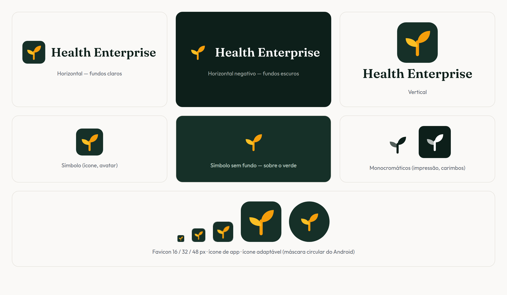
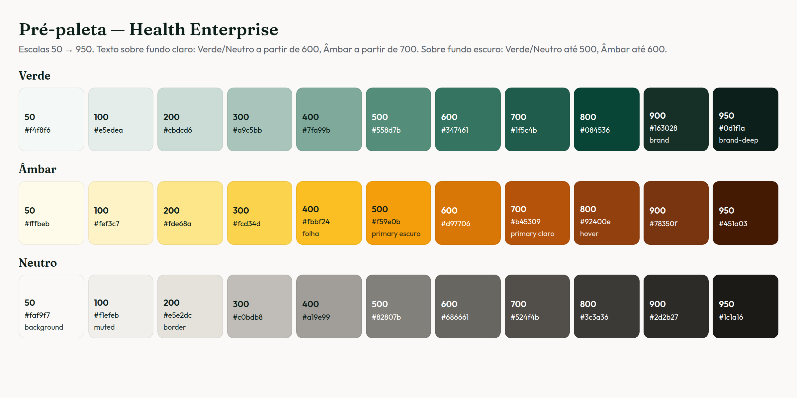
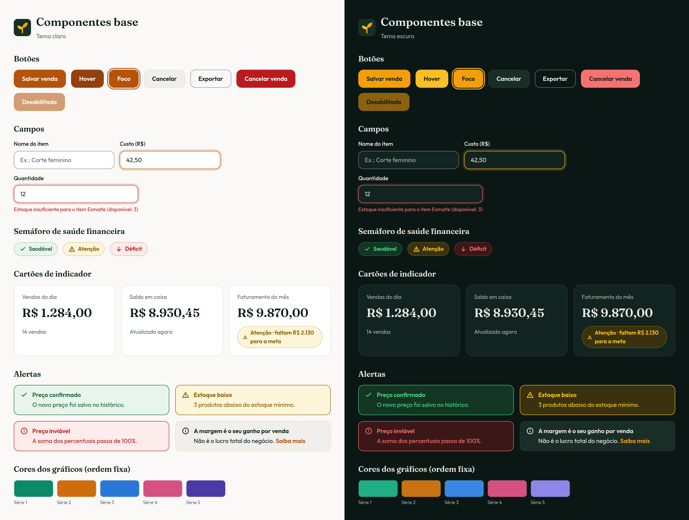
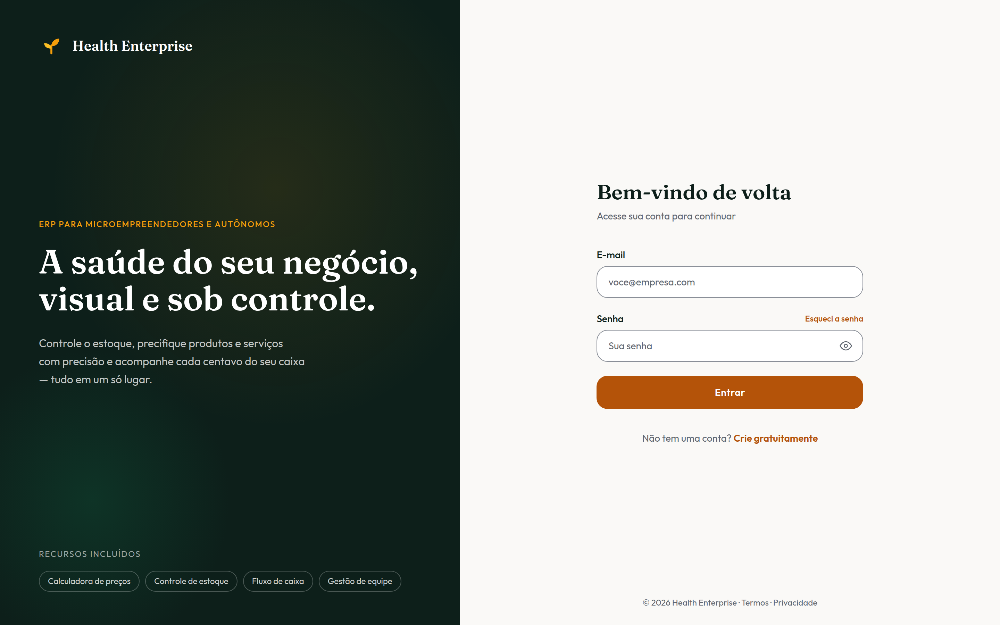
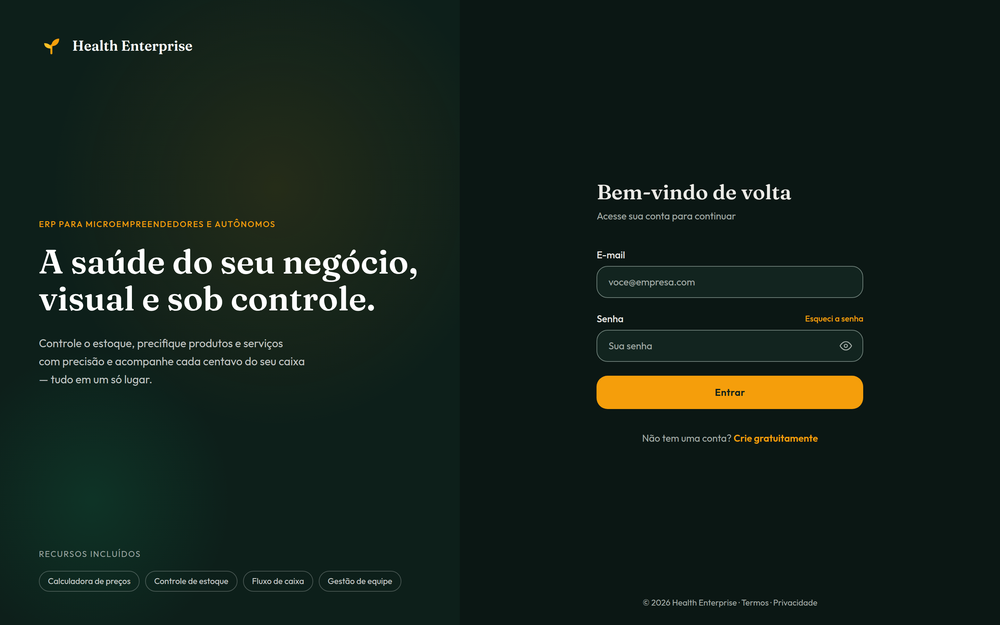
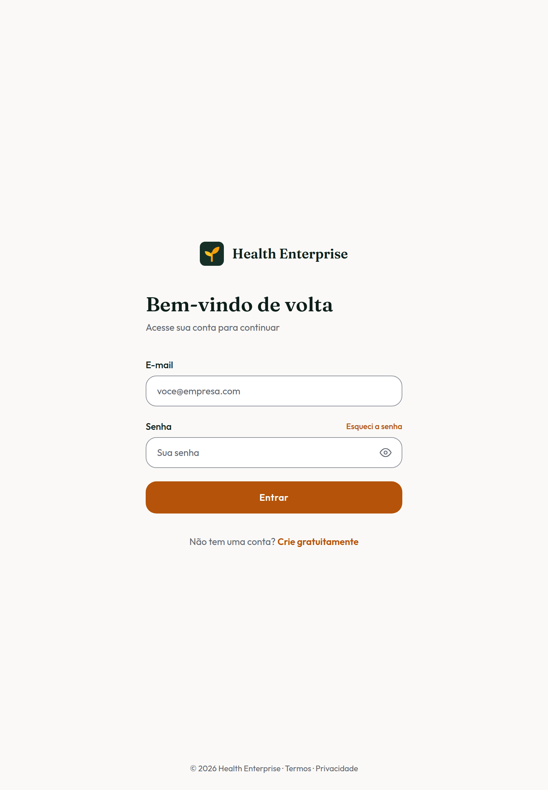
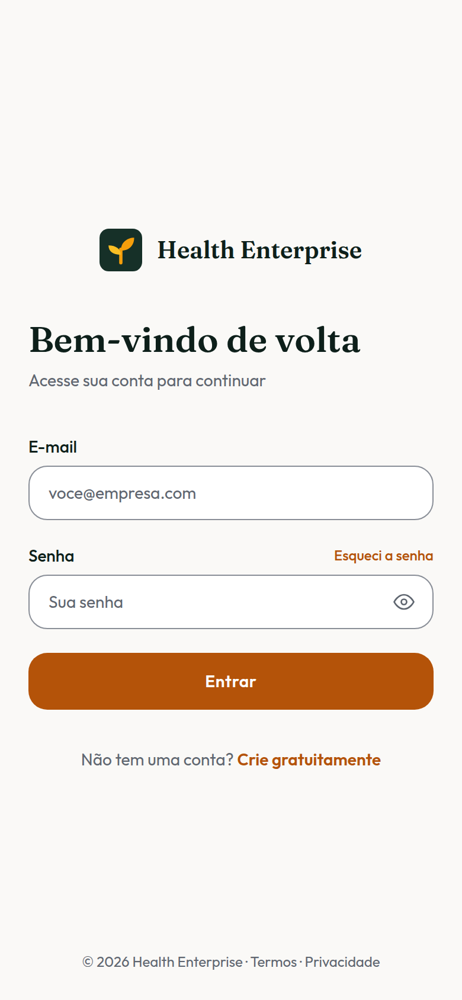
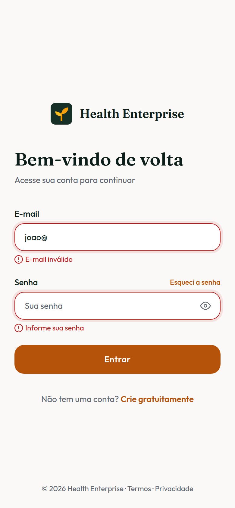

# Identidade Visual — Health Enterprise (HE)

> *A saúde do seu negócio, visual e sob controle.*

Versão navegável deste guia (com prévias ao vivo nos temas claro e escuro): https://claude.ai/artifact/U4zYRjfWbCHKVb3VHGV43e — privada até ser compartilhada pelo menu *Share*.

Guia da identidade visual do produto, construído a partir do protótipo da equipe no Figma (`docs/design/prototipo/`) e das decisões tomadas em entrevista em 02/10/2026. Todos os arquivos citados estão em `docs/design/`.

---

## 1. Conceito

| Elemento | Decisão |
|---|---|
| **Nome** | **Health Enterprise** — abreviado como **HE** em espaços pequenos. Substitui "HE Solutions" e "GestorPRO", que apareciam no protótipo. |
| **Símbolo** | **Broto saudável**: um broto crescendo, que representa o negócio saudável que se desenvolve. As folhas em âmbar remetem a dinheiro e energia; o fundo verde-escuro, a estabilidade. |
| **Direção visual** | A do protótipo: verde-escuro profundo + destaque âmbar + fundo off-white quente, com títulos serifados (Fraunces) e texto sem serifa (Outfit). Os tons foram ajustados para cumprir o contraste da WCAG 2.1 AA. |
| **Personalidade** | Simples, acolhedor e confiável. Sem jargão contábil: o público (personas Camila, Thiago, Gisele e Lucas) quer clareza, não termos técnicos. |

---

## 2. Logo

### 2.1 Arquivos (`identidade/logo/`)

| Arquivo | Uso |
|---|---|
| `he-logo-horizontal.svg` / `.png` | Padrão em fundos claros (cabeçalho do app, documentos). |
| `he-logo-horizontal-negativo.svg` / `.png` | Fundos escuros (painel do login, tema escuro). Usa o broto **sem** o quadrado, porque o quadrado verde some sobre fundos escuros. |
| `he-logo-vertical.svg` / `.png` | Telas de abertura, capas de apresentação. |
| `he-simbolo.svg` / `he-simbolo-512.png` | Ícone isolado, avatar, menu recolhido. |
| `he-simbolo-sem-fundo.svg` | Símbolo sobre o verde da marca. |
| `he-simbolo-mono-verde.svg` / `he-simbolo-mono-branco.svg` | Impressão em uma cor, carimbos, marca-d'água. |

O texto "Health Enterprise" dos SVGs está convertido em contornos (não depende da fonte instalada).

### 2.2 Regras de uso

- **Área de proteção:** mantenha ao redor do logo um espaço livre igual a 1/4 da altura do símbolo.
- **Tamanho mínimo:** símbolo com 24 px; logo horizontal com 120 px de largura.
- **Não fazer:** distorcer, girar, trocar as cores das folhas, aplicar sombra ou contorno, colocar o logo com quadrado sobre fundo verde-escuro (use a versão negativa) ou sobre fotos sem uma área de fundo sólido.

### 2.3 Favicon e ícones de app (`identidade/favicon/`)

`favicon.svg`, `favicon.ico` (16/32/48 px), `favicon-16/32/48.png`, `apple-touch-icon.png` (180 px), `icon-192.png`, `icon-512.png`, `icon-maskable-512.png` (ícone adaptável do Android, com o broto dentro da zona segura) e `site.webmanifest` (nome, cores e ícones para instalar o app no celular).

---

## 3. Cores

As cores são definidas como **tokens** em [`identidade/tokens/tokens.css`](identidade/tokens/tokens.css), no formato do TailwindCSS v4 + shadcn/ui, com um conjunto para o tema claro e outro para o escuro. Use sempre o **token** (ex.: `bg-primary`, `text-muted-foreground`), nunca o código hex direto no componente.

### 3.1 Tema claro

| Token | Hex | Uso |
|---|---|---|
| `background` | `#faf9f7` | Fundo das telas |
| `card` | `#ffffff` | Cartões, campos, menus |
| `foreground` | `#0d1f1a` | Texto principal |
| `muted-foreground` | `#5f6670` | Texto secundário, rodapés |
| `primary` / `primary-hover` | `#b45309` / `#92400e` | Botão principal, links |
| `border` | `#e5e2dc` | Divisórias decorativas |
| `input` | `#8a8f98` | Borda de campos de formulário |
| `ring` | `#b45309` | Anel de foco do teclado |
| `destructive` | `#b91c1c` | Erros, ações destrutivas |
| `brand` / `brand-deep` | `#163028` / `#0d1f1a` | Fundo do símbolo, painel institucional |
| `brand-amber` / `brand-amber-light` | `#f59e0b` / `#fbbf24` | Folhas do broto e destaques **somente sobre fundos verdes** |

### 3.2 Tema escuro

| Token | Hex | Uso |
|---|---|---|
| `background` / `card` | `#0b1714` / `#12241f` | Fundo e cartões |
| `foreground` / `muted-foreground` | `#ecebe7` / `#a7b0ab` | Texto principal e secundário |
| `primary` / `primary-hover` | `#f59e0b` / `#fbbf24` | Botão principal (texto escuro sobre ele), links |
| `border` / `input` / `ring` | `#24392f` / `#6f817a` / `#fbbf24` | Divisórias, campos, foco |
| `destructive` | `#f87171` | Erros |

O tema escuro foi definido **cor a cor** a partir das mesmas famílias, e não invertendo automaticamente o claro. Ele é ativado pela classe `.dark` no `<html>`.

### 3.3 Contraste verificado

Todos os pares de texto e de elementos de interface foram medidos pela WCAG 2.1: mínimo de **4,5:1** para texto e **3:1** para bordas e foco. São **36 pares (18 por tema) e todos passam**; o script [`identidade/tokens/validar_contraste.py`](identidade/tokens/validar_contraste.py) refaz a verificação e deve ser executado sempre que uma cor mudar.

Correções em relação ao protótipo:

| Elemento | Protótipo | Agora |
|---|---|---|
| Botão "Entrar" (branco sobre âmbar) | `#d97706` → 3,19:1 ✗ | `#b45309` → 5,02:1 ✓ |
| Links âmbar | 3,03:1 ✗ | 4,77:1 ✓ |
| Hover dos links (âmbar claro) | 1,59:1 ✗ | `#92400e` → 7,09:1 ✓ |
| Mensagens de erro | `#ef4444` → 3,76:1 ✗ | `#b91c1c` → 6,47:1 ✓ |
| Rodapé e textos apagados (opacidade) | ~2,3:1 ✗ | `muted-foreground` → 5,51:1 ✓ |
| Borda dos campos | 1,47:1 ✗ | `#8a8f98` → 3,25:1 ✓ |

### 3.4 Pré-paleta

Escalas de 50 (mais claro) a 950 (mais escuro) nas famílias **Verde**, **Âmbar** e **Neutro**, ancoradas nas cores já aprovadas. São a fonte de onde novos tons devem sair (fundos de seção, ilustrações, estados), sem inventar cores fora delas.

| Família | Tons que já são tokens | Texto sobre fundo claro | Texto sobre fundo escuro |
|---|---|---|---|
| Verde | 900 = `brand`, 950 = `brand-deep` | a partir de 600 | até 500 |
| Âmbar | 400/500 = folhas do broto, 500 = `primary` escuro, 700 = `primary` claro, 800 = hover | a partir de 700 | até 600 |
| Neutro | 50 = `background`, 100 = `muted`, 200 = `border` | a partir de 600 | até 500 |

- No código: classes do Tailwind como `bg-verde-100`, `text-ambar-700`, `border-neutro-300` (definidas em `tokens.css`).
- Arquivos: [`pre-paleta.json`](identidade/tokens/pre-paleta.json) (valores) e [`tokens-design-system.json`](identidade/tokens/tokens-design-system.json) (todos os tokens, com nota de uso).
- O âmbar `600` (`#d97706`, a cor do protótipo original) **não** serve de fundo para texto branco (3,2:1).
- Quando um tom passar a ter papel fixo na interface, crie um token semântico para ele e rode `validar_contraste.py`.

---

## 4. Semáforo de saúde financeira (RF57)

| Status | Ícone | Texto / fundo (claro) | Texto / fundo (escuro) |
|---|---|---|---|
| **Saudável** | ✓ (check) | `#166534` / `#e8f5ec` — 6,35:1 | `#4ade80` / `#123524` — 7,72:1 |
| **Atenção** | ⚠ (triângulo) | `#8a5a00` / `#fdf6d8` — 5,46:1 | `#facc15` / `#3a3110` — 8,43:1 |
| **Déficit** | ↓ (seta para baixo) | `#b91c1c` / `#fdeceb` — 5,66:1 | `#f87171` / `#3b1717` — 5,75:1 |

**Regra:** o status **nunca é comunicado só pela cor**. Ele aparece sempre com ícone e rótulo escrito ("Saudável", "Atenção", "Déficit"). Isso evita que o âmbar da marca seja confundido com "atenção" e atende pessoas daltônicas. Componente de referência: [`identidade/componentes/SemaforoSaude.tsx`](identidade/componentes/SemaforoSaude.tsx).

As cores de status são **reservadas**: não podem ser usadas em séries de gráficos nem para decoração.

---

## 5. Cores dos gráficos (Dashboard)

| Série | Claro | Escuro |
|---|---|---|
| 1 | `#0b8a68` | `#1fae86` |
| 2 | `#cf6d0c` | `#c97212` |
| 3 | `#2a78d6` | `#3987e5` |
| 4 | `#d55181` | `#d55181` |
| 5 | `#4a3aa7` | `#9085e9` |

Paleta validada nos dois temas: separação para os principais tipos de daltonismo (protanopia, deuteranopia e tritanopia), separação para visão normal, faixa de luminosidade e contraste ≥ 3:1 com o fundo dos cartões. Regras de uso:

- As cores são atribuídas **sempre na mesma ordem** e seguem a entidade, não a posição (um filtro não repinta as séries que sobram).
- **No máximo 5 séries.** A partir da 6ª, agrupe em "Outros" ou divida em gráficos menores.
- Um único eixo vertical (nunca dois eixos com escalas diferentes).
- Legenda sempre presente com 2 ou mais séries; valores e rótulos em cor de texto, nunca na cor da série.

---

## 6. Tipografia

| Papel | Fonte | Pesos | Uso |
|---|---|---|---|
| Títulos e valores de destaque | **Fraunces** (serifada) | 600, 700 | Títulos de tela, valores de KPI (ex.: "R$ 1.284,00"), logo |
| Texto e interface | **Outfit** (sem serifa) | 400, 500, 600 | Texto corrido, rótulos, botões, tabelas |

Escala sugerida: título de tela 30–36 px · título de seção 18–20 px · KPI 28 px · texto 14–16 px · auxiliar 12–13 px. Valores monetários usam algarismos tabulares (`font-variant-numeric: tabular-nums`) para alinhar em tabelas.

**Carregamento:** na aplicação, as fontes devem ser **servidas pelo próprio app** com `next/font/google` (Next.js baixa e hospeda as fontes no build). Assim não há chamada ao Google em tempo de execução (melhor para desempenho e para a LGPD) e a tela não depende de serviço externo. O `@import` do Google Fonts em `tokens.css` serve só para visualizar os arquivos de referência.

---

## 7. Componentes base

Referência visual em [`identidade/componentes/componentes-base.html`](identidade/componentes/componentes-base.html): botões (primário, secundário, contorno, destrutivo, desabilitado, com hover e foco), campos (normal, foco, erro com mensagem), selos do semáforo, cartões de indicador e alertas. Na implementação, os componentes vêm do **shadcn/ui**, que já lê os tokens de `tokens.css`. O selo do semáforo é um componente próprio (`SemaforoSaude.tsx`).

Raio de borda padrão: 12 px (`--radius`), com 16 px em cartões.

---

## 8. Tela de login revisada

| Web | Web — tema escuro |
|---|---|
|  |  |

| Tablet | Smartphone | Smartphone — validação |
|---|---|---|
|  |  |  |

Código em [`prototipo_revisado/App.tsx`](prototipo_revisado/App.tsx). Mudanças em relação ao protótipo original:

- Nome e logo oficiais; "© 2026 Health Enterprise" no rodapé.
- Botão **"Continuar com Google" removido**: a baseline define login só por e-mail e senha (RF01, ADR-003). Login social fica no roadmap.
- Cores via tokens, com contraste corrigido; estados de hover legíveis.
- Campos com `aria-invalid` e mensagem de erro ligada ao campo (`aria-describedby`); "Esqueci a senha" e "Crie gratuitamente" viraram links (`<a>`), pois navegam para outra página.
- Título do painel alinhado ao slogan do produto: "A saúde do seu negócio, visual e sob controle."
- Suporte ao tema escuro.

---

## 9. Aplicação nas Specs

- **SPEC-001 (Fundação):** copiar `tokens.css` para `app/globals.css`, configurar Fraunces e Outfit com `next/font/google`, colocar os arquivos de `favicon/` em `app/` e `public/`, e definir os metadados (nome, `theme-color` `#163028`).
- **SPEC-002 (Acesso):** a tela de login segue `prototipo_revisado/`.
- **SPEC-012 (Dashboard):** semáforo com `SemaforoSaude` e gráficos com a paleta da seção 5.
- Qualquer cor nova deve entrar como token e passar por `validar_contraste.py` antes de ser usada.
