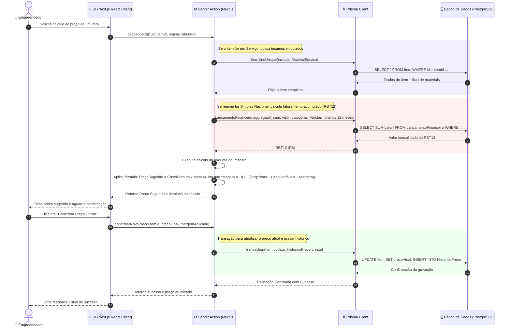
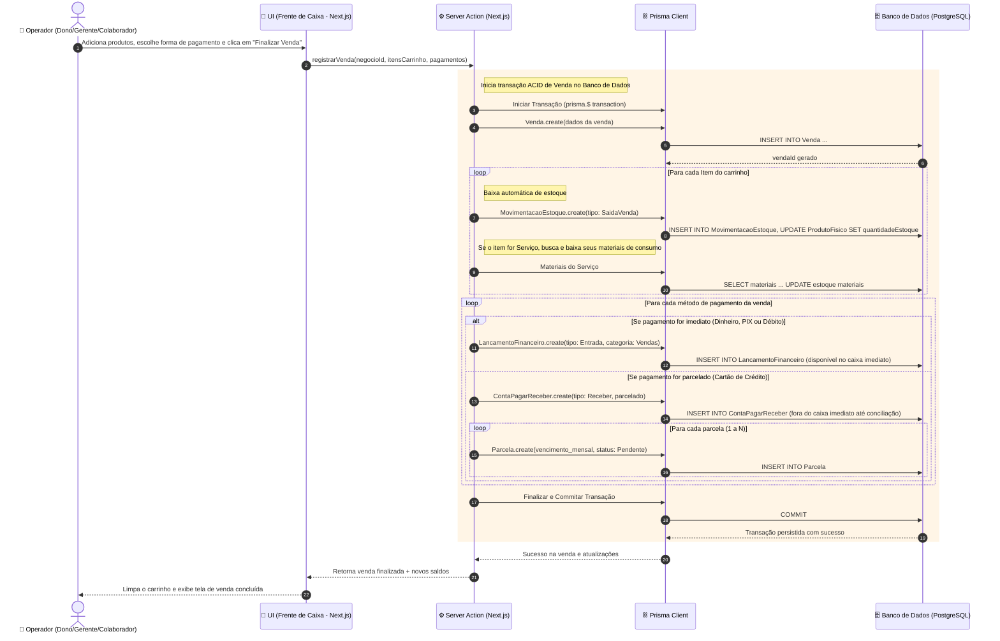
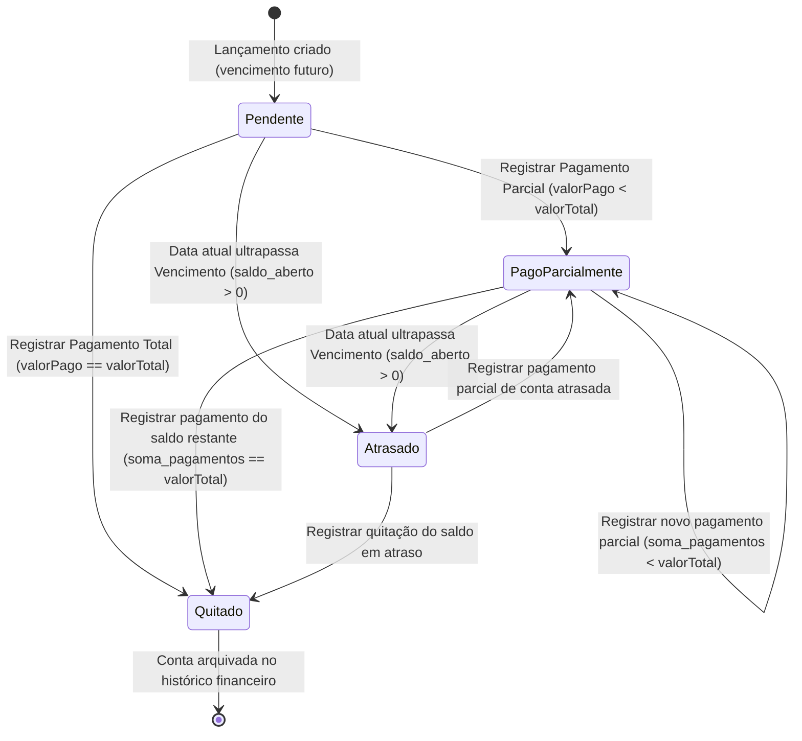

## Diagrama 1: Diagrama de Sequência da Calculadora de Precificação

Este diagrama descreve como a interface, a camada de regras de negócio (Server Actions) e o banco de dados via Prisma trabalham juntos no Next.js para calcular e gravar um preço. Ele engloba a soma dinâmica de insumos se for um serviço e o cálculo da alíquota do Simples Nacional com base no faturamento acumulado (RBT12).

## Diagrama 2: Diagrama de Sequência de Registro de Venda (Integração ERP)

Este diagrama detalha a complexa interação transacional exigida pelas regras de negócio: dar baixa automática em estoque físico, calcular repasse de comissões e dividir pagamentos de cartão de crédito em parcelas a receber futuras.

## Diagrama 3: Diagrama de Transição de Estados da Conta (Pagar/Receber)

Uma das regras de negócio é o suporte a pagamentos parciais. Se uma conta não for quitada inteiramente, ela deve permanecer em aberto exibindo o valor restante. Este diagrama mapeia rigorosamente as transições de estado para orientar os testes unitários no back-end.

