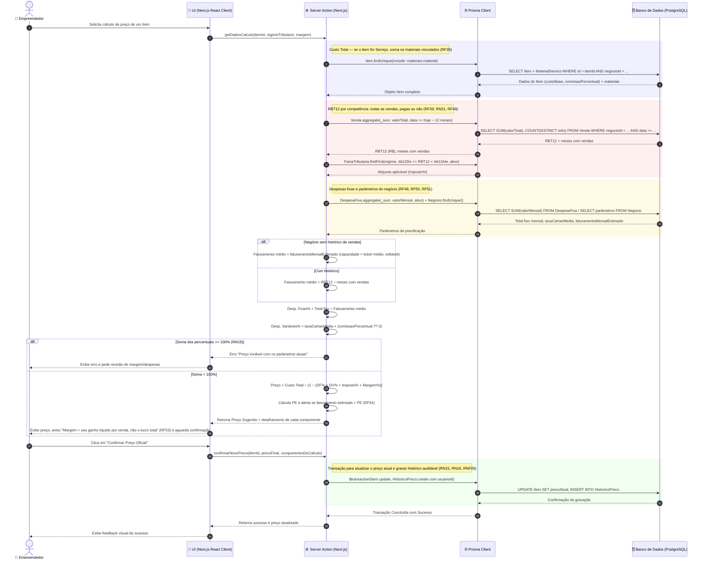
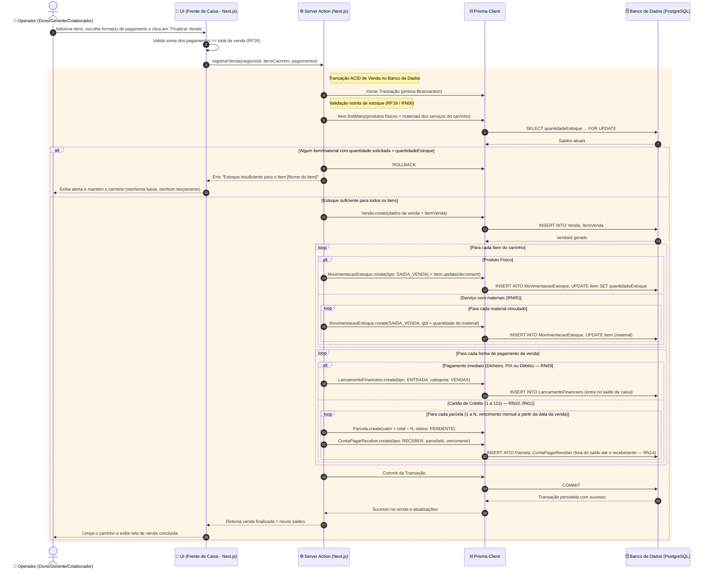
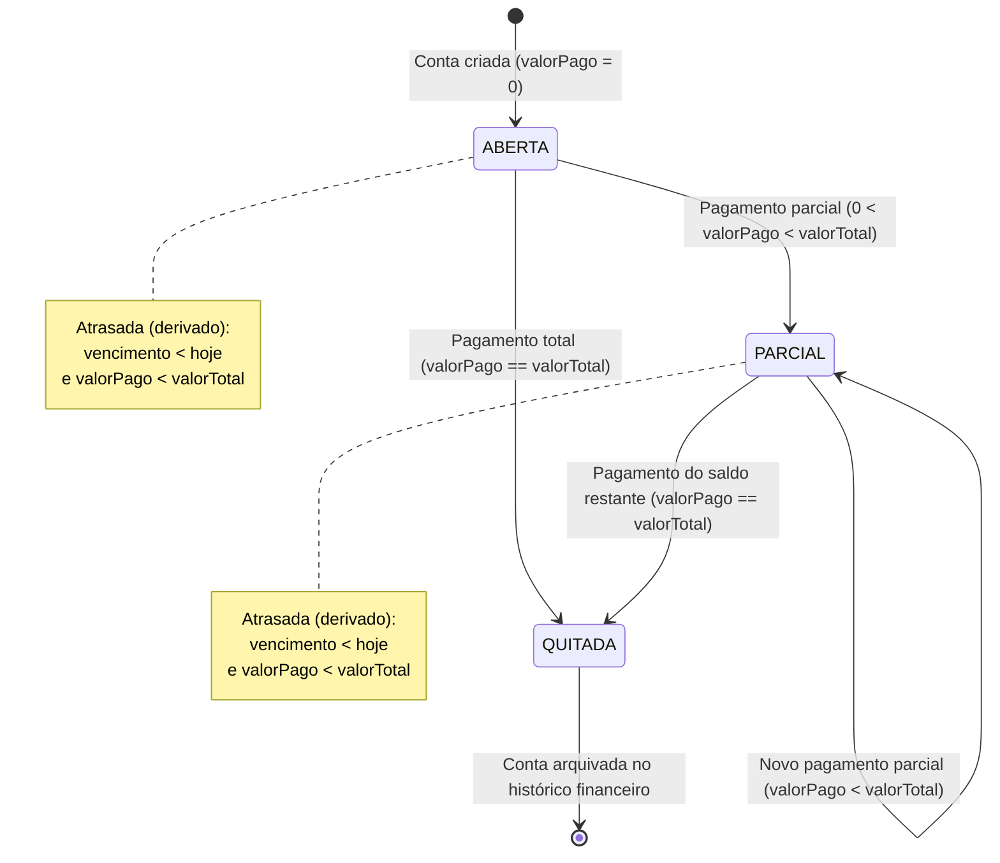

## Diagrama 1: Diagrama de Sequência da Calculadora de Precificação

Este diagrama descreve como a interface, a camada de regras de negócio (Server Actions) e o banco de dados via Prisma trabalham juntos no Next.js para calcular e gravar um preço. Ele engloba a soma dinâmica de insumos se for um serviço, o rateio das despesas fixas, as despesas variáveis (taxa de cartão + comissão opcional) e o cálculo da alíquota do Simples Nacional com base no faturamento acumulado (RBT12).

**Fórmula (RF34 — markup completo):**

```text
Preço = Custo Total ÷ (1 − (Desp. Fixas% + Desp. Variáveis% + Imposto% + Margem%))

Custo Total       = custoBase + Σ (custo do material × quantidade)          (RF35)
Desp. Fixas%      = Σ despesas fixas mensais ÷ faturamento médio mensal     (RF49)
RBT12             = Σ Venda.valorTotal dos últimos 12 meses — todas as vendas, inclusive crédito não recebido (RF39, RN21)
Faturamento médio = RBT12 ÷ meses com vendas (até 12)
                    sem histórico → faturamento estimado (capacidade × ticket médio, editável) (RF50)
Desp. Variáveis%  = taxa média de cartão do negócio + comissão do item (opcional, padrão 0%) (RF51, RF52, RN20)
Imposto%          = alíquota da FaixaTributaria correspondente ao RBT12      (RF38, RN17)
Restrição         = Desp. Fixas% + Desp. Variáveis% + Imposto% + Margem% < 100% (RN19)
```


```mermaid
sequenceDiagram
    autonumber
    actor Empreendedor as 👤 Empreendedor
    participant UI as 📱 UI (Next.js React Client)
    participant Action as ⚙️ Server Action (Next.js)
    participant ORM as ⛓️ Prisma Client
    participant DB as 🗄️ Banco de Dados (PostgreSQL)

    Empreendedor->>UI: Solicita cálculo de preço de um Item
    UI->>Action: getDadosCalculo(itemId, regimeTributario, margem)

    rect rgb(240, 240, 255)
        note right of Action: Custo Total — se o item for Serviço, soma os materiais vinculados (RF35)
        Action->>ORM: Item.findUnique(include: materiais.material)
        ORM->>DB: SELECT Item + MaterialServico WHERE id = itemId AND negocioId = ...
        DB-->>ORM: Dados do Item (custoBase, comissaoPercentual) + materiais
        ORM-->>Action: Objeto Item completo
    end

    rect rgb(255, 240, 240)
        note right of Action: RBT12 por competência: todas as vendas, pagas ou não (RF39, RN21, RF49)
        Action->>ORM: Venda.aggregate(_sum: valorTotal, data >= hoje − 12 meses)
        ORM->>DB: SELECT SUM(valorTotal), COUNT(DISTINCT mês) FROM Venda WHERE negocioId = ... AND data >= ...
        DB-->>ORM: RBT12 + meses com vendas
        ORM-->>Action: RBT12 (R$), meses com vendas
        Action->>ORM: FaixaTributaria.findFirst(regime, rbt12De <= RBT12 < rbt12Ate, ativo)
        ORM-->>Action: Alíquota aplicável (Imposto%)
    end

    rect rgb(255, 250, 230)
        note right of Action: Despesas fixas e parâmetros do negócio (RF48, RF50, RF51)
        Action->>ORM: DespesaFixa.aggregate(_sum: valorMensal, ativo) + Negocio.findUnique()
        ORM->>DB: SELECT SUM(valorMensal) FROM DespesaFixa / SELECT parâmetros FROM Negocio
        DB-->>ORM: Total fixo mensal, taxaCartaoMedia, faturamentoMensalEstimado
        ORM-->>Action: Parâmetros de precificação
    end

    alt Negócio sem histórico de vendas
        Action->>Action: Faturamento médio = faturamentoMensalEstimado (capacidade × ticket médio, editável)
    else Com histórico
        Action->>Action: Faturamento médio = RBT12 ÷ meses com vendas
    end

    Action->>Action: Desp. Fixas% = Total fixo ÷ Faturamento médio
    Action->>Action: Desp. Variáveis% = taxaCartaoMedia + (comissaoPercentual ?? 0)

    alt Soma dos percentuais >= 100% (RN19)
        Action-->>UI: Erro "Preço inviável com os parâmetros atuais"
        UI-->>Empreendedor: Exibe erro e pede revisão de margem/despesas
    else Soma < 100%
        Action->>Action: Preço = Custo Total ÷ (1 − (DF% + DV% + Imposto% + Margem%))
        Action->>Action: Calcula PE e alerta se faturamento estimado < PE (RF54)
        Action-->>UI: Retorna Preço Sugerido + detalhamento de cada componente
        UI-->>Empreendedor: Exibe preço, aviso "Margem = seu ganho líquido por venda, não o lucro total" (RF53) e aguarda confirmação
    end

    Empreendedor->>UI: Clica em "Confirmar Preço Oficial"
    UI->>Action: confirmarNovoPreco(itemId, precoFinal, componentesDoCalculo)

    rect rgb(240, 255, 240)
        note right of Action: Transação para atualizar o preço atual e gravar histórico auditável (RN15, RN16, RNF05)
        Action->>ORM: $transaction(Item.update, HistoricoPreco.create com usuarioId)
        ORM->>DB: UPDATE Item SET precoAtual, INSERT INTO HistoricoPreco
        DB-->>ORM: Confirmação da gravação
    end

    ORM-->>Action: Transação Concluída com Sucesso
    Action-->>UI: Retorna sucesso e preço atualizado
    UI-->>Empreendedor: Exibe feedback visual de sucesso
```

## Diagrama 2: Diagrama de Sequência de Registro de Venda (Integração ERP)

Este diagrama detalha a interação transacional exigida pelas regras de negócio: validar previamente o estoque (RF18/RN06), dar baixa automática em estoque físico e nos materiais de serviços (RN05), gerar lançamentos imediatos para pagamentos à vista (RN09) e dividir pagamentos de cartão de crédito em parcelas, cada uma originando sua conta a receber (RN10). Taxa de cartão e comissão não são descontadas nem repassadas no MVP (RN11, RN20).


```mermaid
sequenceDiagram
    autonumber
    actor Operador as 👤 Operador (Dono/Gerente/Colaborador)
    participant UI as 📱 UI (Frente de Caixa - Next.js)
    participant Action as ⚙️ Server Action (Next.js)
    participant ORM as ⛓️ Prisma Client
    participant DB as 🗄️ Banco de Dados (PostgreSQL)

    Operador->>UI: Adiciona itens, escolhe forma(s) de pagamento e clica em "Finalizar Venda"
    UI->>UI: Valida soma dos pagamentos == total da venda (RF26)
    UI->>Action: registrarVenda(negocioId, itensCarrinho, pagamentos)

    rect rgb(255, 245, 230)
        note right of Action: Transação ACID de Venda no Banco de Dados
        Action->>ORM: Iniciar Transação (prisma.$transaction)

        note right of Action: Validação estrita de estoque (RF18 / RN06)
        Action->>ORM: Item.findMany(produtos físicos + materiais dos serviços do carrinho)
        ORM->>DB: SELECT quantidadeEstoque ... FOR UPDATE
        DB-->>ORM: Saldos atuais

        alt Algum item/material com quantidade solicitada > quantidadeEstoque
            Action->>ORM: ROLLBACK
            Action-->>UI: Erro "Estoque insuficiente para o item [Nome do Item]"
            UI-->>Operador: Exibe alerta e mantém o carrinho (nenhuma baixa, nenhum lançamento)
        else Estoque suficiente para todos os itens
            Action->>ORM: Venda.create(dados da venda + ItemVenda)
            ORM->>DB: INSERT INTO Venda, ItemVenda
            DB-->>ORM: vendaId gerado

            loop Para cada Item do carrinho
                alt Produto Físico
                    Action->>ORM: MovimentacaoEstoque.create(tipo: SAIDA_VENDA) + Item.update(decrement)
                    ORM->>DB: INSERT INTO MovimentacaoEstoque, UPDATE Item SET quantidadeEstoque
                else Serviço com materiais (RN05)
                    loop Para cada material vinculado
                        Action->>ORM: MovimentacaoEstoque.create(SAIDA_VENDA, qtd × quantidade do material)
                        ORM->>DB: INSERT INTO MovimentacaoEstoque, UPDATE Item (material)
                    end
                end
            end

            loop Para cada forma de pagamento da venda
                alt Pagamento imediato (Dinheiro, PIX ou Débito) — RN09
                    Action->>ORM: LancamentoFinanceiro.create(tipo: ENTRADA, categoria: VENDAS)
                    ORM->>DB: INSERT INTO LancamentoFinanceiro (entra no saldo de caixa)
                else Cartão de Crédito (1 a 12x) — RN10, RN11
                    loop Para cada parcela (1 a N, vencimento mensal a partir da data da venda)
                        Action->>ORM: Parcela.create(valor = total ÷ N, status: PENDENTE)
                        Action->>ORM: ContaPagarReceber.create(tipo: RECEBER, parcelaId, vencimento)
                        ORM->>DB: INSERT INTO Parcela, ContaPagarReceber (fora do saldo até o recebimento — RN14)
                    end
                end
            end

            Action->>ORM: Commit da Transação
            ORM->>DB: COMMIT
            DB-->>ORM: Transação persistida com sucesso
            ORM-->>Action: Sucesso na venda e atualizações
            Action-->>UI: Retorna venda finalizada + novos saldos
            UI-->>Operador: Limpa o carrinho e exibe tela de venda concluída
        end
    end
```

## Diagrama 3: Diagrama de Transição de Estados da Conta (Pagar/Receber)

Uma das regras de negócio é o suporte a pagamentos parciais (RF31). Se uma conta não for quitada inteiramente, ela permanece em aberto exibindo o valor restante. Os estados persistidos são os do enum `StatusConta` do schema (`ABERTA`, `PARCIAL`, `QUITADA`). **"Atrasada" não é um estado persistido**: é uma condição derivada, exibida na interface quando `vencimento < hoje` e `valorPago < valorTotal` (vale tanto para `ABERTA` quanto para `PARCIAL`).


```mermaid
stateDiagram-v2
    [*] --> ABERTA : Conta criada (valorPago = 0)

    ABERTA --> QUITADA : Pagamento total (valorPago == valorTotal)
    ABERTA --> PARCIAL : Pagamento parcial (0 < valorPago < valorTotal)

    PARCIAL --> PARCIAL : Novo pagamento parcial (valorPago < valorTotal)
    PARCIAL --> QUITADA : Pagamento do saldo restante (valorPago == valorTotal)

    QUITADA --> [*] : Conta arquivada no histórico financeiro

    note right of ABERTA
        Atrasada (derivado):
        vencimento < hoje
        e valorPago < valorTotal
    end note
    note right of PARCIAL
        Atrasada (derivado):
        vencimento < hoje
        e valorPago < valorTotal
    end note
```
