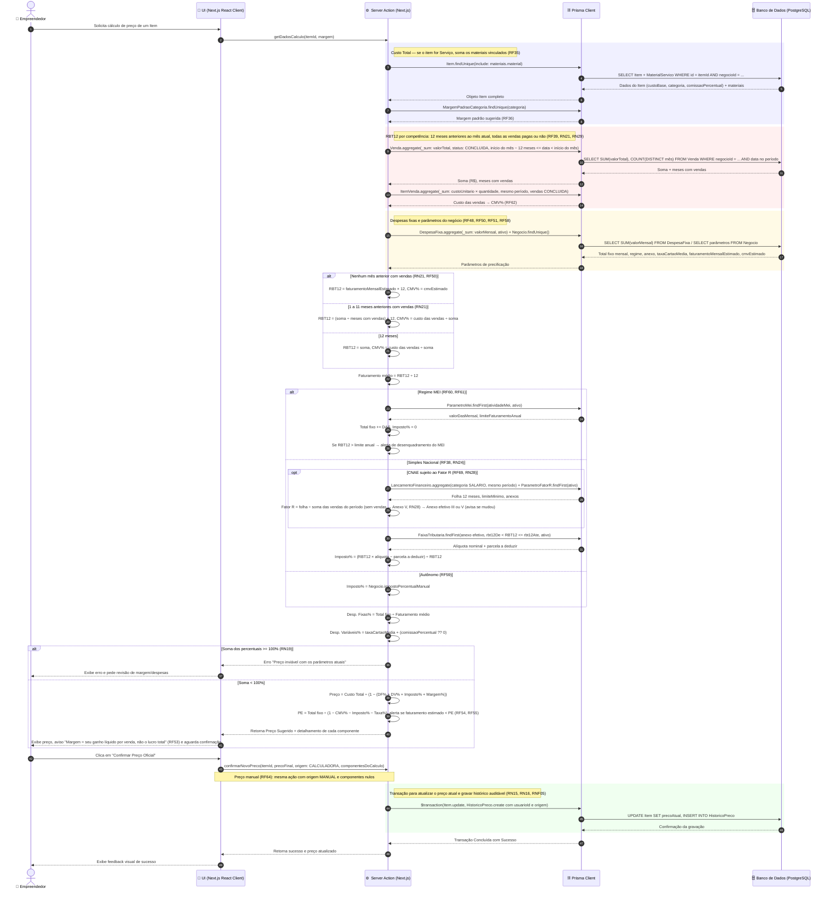
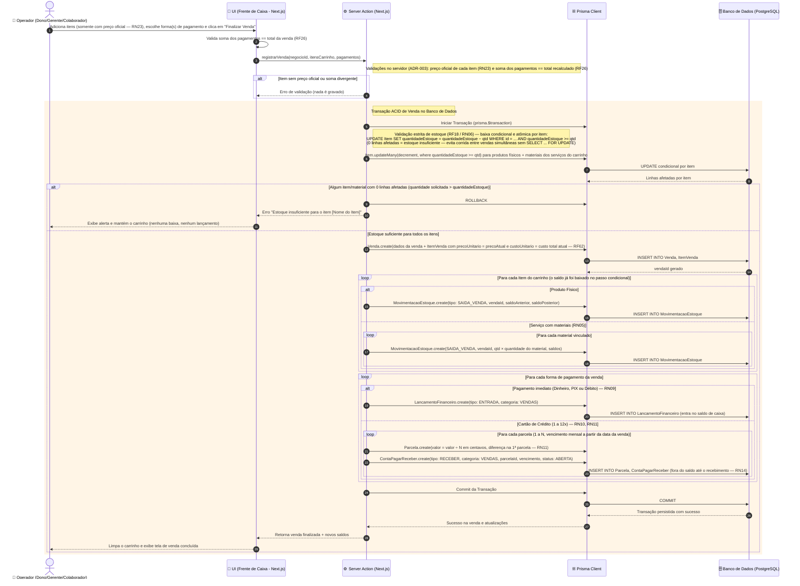
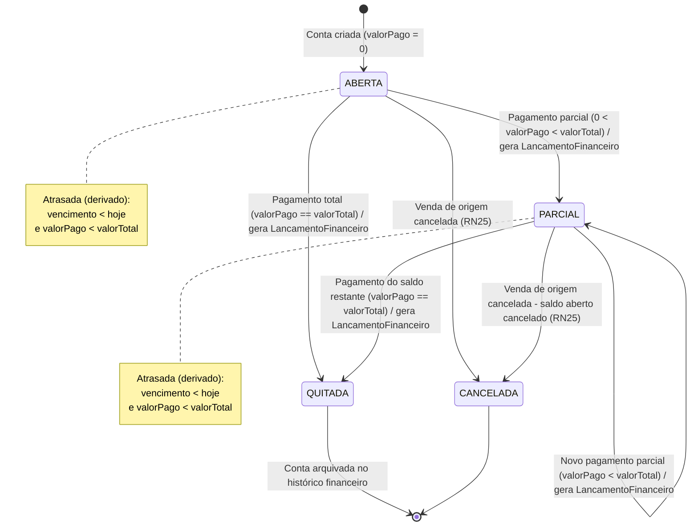
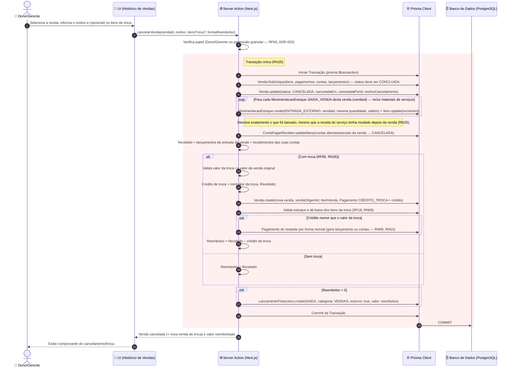

## Diagrama 1: Diagrama de Sequência da Calculadora de Precificação

Este diagrama descreve como a interface, a camada de regras de negócio (Server Actions) e o banco de dados via Prisma trabalham juntos no Next.js para calcular e gravar um preço. Ele engloba a soma dinâmica de insumos se for um serviço, o rateio das despesas fixas, as despesas variáveis (taxa de cartão + comissão opcional) e o cálculo da alíquota do Simples Nacional com base no faturamento acumulado (RBT12).

**Fórmula (RF34 — markup completo):**

```text
Preço = Custo Total ÷ (1 − (Desp. Fixas% + Desp. Variáveis% + Imposto% + Margem%))

Custo Total       = custoBase + Σ (custo do material × quantidade)          (RF35)
Desp. Fixas%      = (Σ despesas fixas mensais + DAS se MEI) ÷ faturamento médio mensal (RF49, RF60)
RBT12             = Σ Venda.valorTotal dos 12 meses anteriores ao mês do cálculo — todas as vendas não canceladas,
                    inclusive crédito não recebido (RF39, RN21, RN25)
                    1 a 11 meses anteriores com vendas → média mensal desses meses × 12 (RN21)
                    nenhum mês anterior com vendas    → faturamento estimado × 12 (RN21, RF50) — RBT12 nunca é zero
Faturamento médio = RBT12 ÷ 12 (já proporcionalizado)
                    sem histórico → faturamento estimado (capacidade × ticket médio, editável) (RF50)
Desp. Variáveis%  = taxa média de cartão do negócio + comissão do item (opcional, padrão 0%) (RF51, RF52, RN20)
Imposto%          = Simples: (RBT12 × alíquota nominal − parcela a deduzir) ÷ RBT12, pela FaixaTributaria do Anexo efetivo,
                             na faixa em que rbt12De < RBT12 ≤ rbt12Ate (RF38, RN24)
                             Anexo efetivo: CNAE sujeito ao Fator R → Fator R = folha (Salário) ÷ vendas, no mesmo período do RBT12;
                             ≥ ParametroFatorR.limiteMinimo (28%) → Anexo III, senão V (RF69, RN28)
                    MEI: 0% — o DAS já está nas despesas fixas (RF60)
                    Autônomo: percentual informado no cadastro (RF59)
Margem%           = sugerida pela MargemPadraoCategoria da categoria do item, editável (RF36)
Restrição         = Desp. Fixas% + Desp. Variáveis% + Imposto% + Margem% < 100% (RN19)
```

**Ponto de equilíbrio e meta (RF55, RF56, RF62):**

```text
CMV%  = Σ (ItemVenda.custoUnitario × quantidade) ÷ RBT12   — sem histórico: Negocio.cmvEstimado
PE    = Despesas fixas (+ DAS) ÷ (1 − CMV% − Imposto% − Taxa média de cartão%)
Meta  = Despesas fixas (+ DAS) ÷ (1 − CMV% − Imposto% − Taxa média de cartão% − Margem meta%)
```


```mermaid
sequenceDiagram
    autonumber
    actor Empreendedor as 👤 Empreendedor
    participant UI as 📱 UI (Next.js React Client)
    participant Action as ⚙️ Server Action (Next.js)
    participant ORM as ⛓️ Prisma Client
    participant DB as 🗄️ Banco de Dados (PostgreSQL)

    Empreendedor->>UI: Solicita cálculo de preço de um Item
    UI->>Action: getDadosCalculo(itemId, margem)

    rect rgb(240, 240, 255)
        note right of Action: Custo Total — se o item for Serviço, soma os materiais vinculados (RF35)
        Action->>ORM: Item.findUnique(include: materiais.material)
        ORM->>DB: SELECT Item + MaterialServico WHERE id = itemId AND negocioId = ...
        DB-->>ORM: Dados do Item (custoBase, categoria, comissaoPercentual) + materiais
        ORM-->>Action: Objeto Item completo
        Action->>ORM: MargemPadraoCategoria.findUnique(categoria)
        ORM-->>Action: Margem padrão sugerida (RF36)
    end

    rect rgb(255, 240, 240)
        note right of Action: RBT12 por competência: 12 meses anteriores ao mês atual, todas as vendas pagas ou não (RF39, RN21, RN29)
        Action->>ORM: Venda.aggregate(_sum: valorTotal, status: CONCLUIDA, início do mês − 12 meses <= data < início do mês)
        ORM->>DB: SELECT SUM(valorTotal), COUNT(DISTINCT mês) FROM Venda WHERE negocioId = ... AND data no período
        DB-->>ORM: Soma + meses com vendas
        ORM-->>Action: Soma (R$), meses com vendas
        Action->>ORM: ItemVenda.aggregate(_sum: custoUnitario × quantidade, mesmo período, vendas CONCLUIDA)
        ORM-->>Action: Custo das vendas → CMV% (RF62)
    end

    rect rgb(255, 250, 230)
        note right of Action: Despesas fixas e parâmetros do negócio (RF48, RF50, RF51, RF58)
        Action->>ORM: DespesaFixa.aggregate(_sum: valorMensal, ativo) + Negocio.findUnique()
        ORM->>DB: SELECT SUM(valorMensal) FROM DespesaFixa / SELECT parâmetros FROM Negocio
        DB-->>ORM: Total fixo mensal, regime, anexo, taxaCartaoMedia, faturamentoMensalEstimado, cmvEstimado
        ORM-->>Action: Parâmetros de precificação
    end

    alt Nenhum mês anterior com vendas (RN21, RF50)
        Action->>Action: RBT12 = faturamentoMensalEstimado × 12, CMV% = cmvEstimado
    else 1 a 11 meses anteriores com vendas (RN21)
        Action->>Action: RBT12 = (soma ÷ meses com vendas) × 12, CMV% = custo das vendas ÷ soma
    else 12 meses
        Action->>Action: RBT12 = soma, CMV% = custo das vendas ÷ soma
    end
    Action->>Action: Faturamento médio = RBT12 ÷ 12

    alt Regime MEI (RF60, RF61)
        Action->>ORM: ParametroMei.findFirst(atividadeMei, ativo)
        ORM-->>Action: valorDasMensal, limiteFaturamentoAnual
        Action->>Action: Total fixo += DAS, Imposto% = 0
        Action->>Action: Se RBT12 > limite anual → alerta de desenquadramento do MEI
    else Simples Nacional (RF38, RN24)
        opt CNAE sujeito ao Fator R (RF69, RN28)
            Action->>ORM: LancamentoFinanceiro.aggregate(categoria SALARIO, mesmo período) + ParametroFatorR.findFirst(ativo)
            ORM-->>Action: Folha 12 meses, limiteMinimo, anexos
            Action->>Action: Fator R = folha ÷ soma das vendas do período (sem vendas → Anexo V, RN28) → Anexo efetivo III ou V (avisa se mudou)
        end
        Action->>ORM: FaixaTributaria.findFirst(anexo efetivo, rbt12De < RBT12 <= rbt12Ate, ativo)
        ORM-->>Action: Alíquota nominal + parcela a deduzir
        Action->>Action: Imposto% = (RBT12 × alíquota − parcela a deduzir) ÷ RBT12
    else Autônomo (RF59)
        Action->>Action: Imposto% = Negocio.impostoPercentualManual
    end

    Action->>Action: Desp. Fixas% = Total fixo ÷ Faturamento médio
    Action->>Action: Desp. Variáveis% = taxaCartaoMedia + (comissaoPercentual ?? 0)

    alt Soma dos percentuais >= 100% (RN19)
        Action-->>UI: Erro "Preço inviável com os parâmetros atuais"
        UI-->>Empreendedor: Exibe erro e pede revisão de margem/despesas
    else Soma < 100%
        Action->>Action: Preço = Custo Total ÷ (1 − (DF% + DV% + Imposto% + Margem%))
        Action->>Action: PE = Total fixo ÷ (1 − CMV% − Imposto% − Taxa%), alerta se faturamento estimado < PE (RF54, RF55)
        Action-->>UI: Retorna Preço Sugerido + detalhamento de cada componente
        UI-->>Empreendedor: Exibe preço, aviso "Margem = seu ganho líquido por venda, não o lucro total" (RF53) e aguarda confirmação
    end

    Empreendedor->>UI: Clica em "Confirmar Preço Oficial"
    UI->>Action: confirmarNovoPreco(itemId, precoFinal, origem: CALCULADORA, componentesDoCalculo)
    note over UI,Action: Preço manual (RF64): mesma ação com origem MANUAL e componentes nulos

    rect rgb(240, 255, 240)
        note right of Action: Transação para atualizar o preço atual e gravar histórico auditável (RN15, RN16, RNF05)
        Action->>ORM: $transaction(Item.update, HistoricoPreco.create com usuarioId e origem)
        ORM->>DB: UPDATE Item SET precoAtual, INSERT INTO HistoricoPreco
        DB-->>ORM: Confirmação da gravação
    end

    ORM-->>Action: Transação Concluída com Sucesso
    Action-->>UI: Retorna sucesso e preço atualizado
    UI-->>Empreendedor: Exibe feedback visual de sucesso
```

## Diagrama 2: Diagrama de Sequência de Registro de Venda (Integração ERP)

Este diagrama detalha a interação transacional exigida pelas regras de negócio: validar previamente o estoque (RF18/RN06), dar baixa automática em estoque físico e nos materiais de serviços (RN05), gerar lançamentos imediatos para pagamentos à vista (RN09) e dividir pagamentos de cartão de crédito em parcelas, cada uma originando sua conta a receber (RN10). Taxa de cartão e comissão não são descontadas nem repassadas no MVP (RN11, RN20). Só itens com preço oficial podem entrar no carrinho (RN23), e o valor e o custo de cada item são definidos pelo servidor, não pelo cliente.


```mermaid
sequenceDiagram
    autonumber
    actor Operador as 👤 Operador (Dono/Gerente/Colaborador)
    participant UI as 📱 UI (Frente de Caixa - Next.js)
    participant Action as ⚙️ Server Action (Next.js)
    participant ORM as ⛓️ Prisma Client
    participant DB as 🗄️ Banco de Dados (PostgreSQL)

    Operador->>UI: Adiciona itens (somente com preço oficial — RN23), escolhe forma(s) de pagamento e clica em "Finalizar Venda"
    UI->>UI: Valida soma dos pagamentos == total da venda (RF26)
    UI->>Action: registrarVenda(negocioId, itensCarrinho, pagamentos)

    note right of Action: Validações no servidor (ADR-003): preço oficial de cada item (RN23) e soma dos pagamentos == total recalculado (RF26)
    alt Item sem preço oficial ou soma divergente
        Action-->>UI: Erro de validação (nada é gravado)
    end

    rect rgb(255, 245, 230)
        note right of Action: Transação ACID de Venda no Banco de Dados
        Action->>ORM: Iniciar Transação (prisma.$transaction)

        note right of Action: Validação estrita de estoque (RF18 / RN06) — baixa condicional e atômica por item:<br/>UPDATE Item SET quantidadeEstoque = quantidadeEstoque − qtd WHERE id = ... AND quantidadeEstoque >= qtd<br/>(0 linhas afetadas = estoque insuficiente — evita corrida entre vendas simultâneas sem SELECT ... FOR UPDATE)
        Action->>ORM: Item.updateMany(decrement, where quantidadeEstoque >= qtd) para produtos físicos + materiais dos serviços do carrinho
        ORM->>DB: UPDATE condicional por item
        DB-->>ORM: Linhas afetadas por item

        alt Algum item/material com 0 linhas afetadas (quantidade solicitada > quantidadeEstoque)
            Action->>ORM: ROLLBACK
            Action-->>UI: Erro "Estoque insuficiente para o item [Nome do Item]"
            UI-->>Operador: Exibe alerta e mantém o carrinho (nenhuma baixa, nenhum lançamento)
        else Estoque suficiente para todos os itens
            Action->>ORM: Venda.create(dados da venda + ItemVenda com precoUnitario = precoAtual e custoUnitario = custo total atual — RF62)
            ORM->>DB: INSERT INTO Venda, ItemVenda
            DB-->>ORM: vendaId gerado

            loop Para cada Item do carrinho (o saldo já foi baixado no passo condicional)
                alt Produto Físico
                    Action->>ORM: MovimentacaoEstoque.create(tipo: SAIDA_VENDA, vendaId, saldoAnterior, saldoPosterior)
                    ORM->>DB: INSERT INTO MovimentacaoEstoque
                else Serviço com materiais (RN05)
                    loop Para cada material vinculado
                        Action->>ORM: MovimentacaoEstoque.create(SAIDA_VENDA, vendaId, qtd × quantidade do material, saldos)
                        ORM->>DB: INSERT INTO MovimentacaoEstoque
                    end
                end
            end

            loop Para cada forma de pagamento da venda
                alt Pagamento imediato (Dinheiro, PIX ou Débito) — RN09
                    Action->>ORM: LancamentoFinanceiro.create(tipo: ENTRADA, categoria: VENDAS)
                    ORM->>DB: INSERT INTO LancamentoFinanceiro (entra no saldo de caixa)
                else Cartão de Crédito (1 a 12x) — RN10, RN11
                    loop Para cada parcela (1 a N, vencimento mensal a partir da data da venda)
                        Action->>ORM: Parcela.create(valor = valor ÷ N em centavos, diferença na 1ª parcela — RN11)
                        Action->>ORM: ContaPagarReceber.create(tipo: RECEBER, categoria: VENDAS, parcelaId, vencimento, status: ABERTA)
                        ORM->>DB: INSERT INTO Parcela, ContaPagarReceber (fora do saldo até o recebimento — RN14)
                    end
                end
            end

            Action->>ORM: Commit da Transação
            ORM->>DB: COMMIT
            DB-->>ORM: Transação persistida com sucesso
            ORM-->>Action: Sucesso na venda e atualizações
            Action-->>UI: Retorna venda finalizada + novos saldos
            UI-->>Operador: Limpa o carrinho e exibe tela de venda concluída
        end
    end
```

## Diagrama 3: Diagrama de Transição de Estados da Conta (Pagar/Receber)

Uma das regras de negócio é o suporte a pagamentos parciais (RF31). Se uma conta não for quitada inteiramente, ela permanece em aberto exibindo o valor restante. Os estados persistidos são os do enum `StatusConta` do schema (`ABERTA`, `PARCIAL`, `QUITADA`, `CANCELADA`), e são a única fonte de verdade — inclusive para as parcelas de cartão, que não têm status próprio. **Todo pagamento ou recebimento registrado (total ou parcial) gera um `LancamentoFinanceiro`** vinculado à conta, com a categoria da conta: `ENTRADA` para contas a receber e `SAIDA` para contas a pagar (RN22). É assim que o valor entra no saldo de caixa (RN14). **"Atrasada" não é um estado persistido**: é uma condição derivada, exibida na interface quando `vencimento < hoje` e `valorPago < valorTotal` (vale tanto para `ABERTA` quanto para `PARCIAL`).


```mermaid
stateDiagram-v2
    [*] --> ABERTA : Conta criada (valorPago = 0)

    ABERTA --> QUITADA : Pagamento total (valorPago == valorTotal) / gera LancamentoFinanceiro
    ABERTA --> PARCIAL : Pagamento parcial (0 < valorPago < valorTotal) / gera LancamentoFinanceiro

    PARCIAL --> PARCIAL : Novo pagamento parcial (valorPago < valorTotal) / gera LancamentoFinanceiro
    PARCIAL --> QUITADA : Pagamento do saldo restante (valorPago == valorTotal) / gera LancamentoFinanceiro

    ABERTA --> CANCELADA : Venda de origem cancelada (RN25)
    PARCIAL --> CANCELADA : Venda de origem cancelada - saldo aberto cancelado (RN25)

    QUITADA --> [*] : Conta arquivada no histórico financeiro
    CANCELADA --> [*]

    note right of ABERTA
        Atrasada (derivado):
        vencimento < hoje
        e valorPago < valorTotal
    end note
    note right of PARCIAL
        Atrasada (derivado):
        vencimento < hoje
        e valorPago < valorTotal
    end note
```

## Diagrama 4: Diagrama de Sequência de Cancelamento e Troca de Venda

Cancelamento total de uma venda por Dono ou Gerente (ou Colaborador com permissão granular), com motivo obrigatório (RF65). Tudo ocorre em uma única transação (RN25): a venda passa a `CANCELADA` (nunca é apagada), o estoque volta por `ENTRADA_ESTORNO`, as contas a receber abertas são canceladas e os valores já recebidos são estornados. Opcionalmente, o operador faz uma **troca** por itens de valor menor ou igual (RF66): a nova venda usa o crédito de troca, limitado ao valor já recebido (RN26), e só a diferença é reembolsada.

**Exemplo:** venda de R$ 100,00 em PIX trocada por item de R$ 70,00 → crédito de troca R$ 70,00 (sem lançamento), estorno/reembolso R$ 30,00 (lançamento de saída). Saldo de caixa final da operação: R$ 70,00.


```mermaid
sequenceDiagram
    autonumber
    actor Operador as 👤 Dono/Gerente
    participant UI as 📱 UI (Histórico de Vendas)
    participant Action as ⚙️ Server Action (Next.js)
    participant ORM as ⛓️ Prisma Client
    participant DB as 🗄️ Banco de Dados (PostgreSQL)

    Operador->>UI: Seleciona a venda, informa o motivo e (opcional) os itens de troca
    UI->>Action: cancelarVenda(vendaId, motivo, itensTroca?, formaReembolso)
    Action->>Action: Verifica papel (Dono/Gerente ou permissão granular — RF65, ADR-003)

    rect rgb(255, 240, 240)
        note right of Action: Transação única (RN25)
        Action->>ORM: Iniciar Transação (prisma.$transaction)
        Action->>ORM: Venda.findUnique(itens, pagamentos, contas, lançamentos) — status deve ser CONCLUIDA
        Action->>ORM: Venda.update(status: CANCELADA, canceladaEm, canceladaPorId, motivoCancelamento)

        loop Para cada MovimentacaoEstoque SAIDA_VENDA desta venda (vendaId) — inclui materiais de serviços
            Action->>ORM: MovimentacaoEstoque.create(ENTRADA_ESTORNO, vendaId, mesma quantidade, saldos) + Item.update(increment)
        end
        note right of Action: Devolve exatamente o que foi baixado, mesmo que a receita do serviço tenha mudado depois da venda (RN25)

        Action->>ORM: ContaPagarReceber.updateMany(contas abertas/parciais da venda → CANCELADA)
        Action->>Action: Recebido = lançamentos de entrada da venda + recebimentos das suas contas

        alt Com troca (RF66, RN26)
            Action->>Action: Valida valor da troca <= valor da venda original
            Action->>Action: Crédito de troca = min(valor da troca, Recebido)
            Action->>ORM: Venda.create(nova venda, vendaOrigemId, ItemVenda, Pagamento CREDITO_TROCA = crédito)
            Action->>ORM: Valida estoque e dá baixa dos itens da troca (RF18, RN06)
            opt Crédito menor que o valor da troca
                Action->>ORM: Pagamento do restante por forma normal (gera lançamento ou contas — RN09, RN10)
            end
            Action->>Action: Reembolso = Recebido − crédito de troca
        else Sem troca
            Action->>Action: Reembolso = Recebido
        end

        opt Reembolso > 0
            Action->>ORM: LancamentoFinanceiro.create(SAIDA, categoria: VENDAS, estorno: true, valor: reembolso)
        end

        Action->>ORM: Commit da Transação
        ORM->>DB: COMMIT
    end

    Action-->>UI: Venda cancelada (+ nova venda de troca) e valor reembolsado
    UI-->>Operador: Exibe comprovante do cancelamento/troca
```

