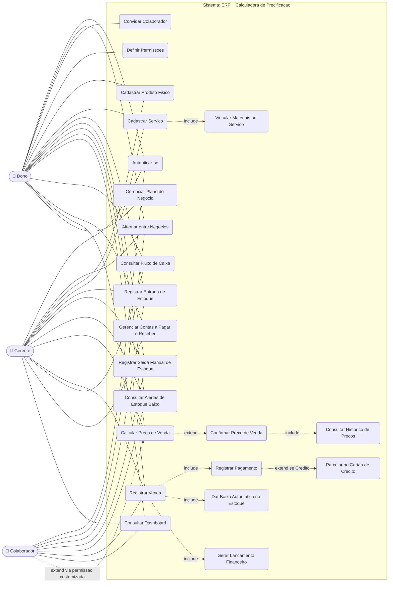

# Diagrama de Caso de Uso

## ERP + Calculadora de Precificação para Microempreendedores e Autônomos

*Documento complementar — construído a partir dos RF, RNF e Regras de Negócio*

---

## Legenda

| Elemento | Significado |
|---|---|
| Linha contínua (`---`) | Associação direta entre ator e caso de uso |
| `-.->\|include\|` | O caso de uso de origem sempre executa o caso de uso de destino como parte do seu fluxo |
| `-.->\|extend\|` | O caso de uso de destino só ocorre condicionalmente, estendendo o fluxo do caso de uso de origem |

## Casos de uso por ator

| Ator | Casos de uso |
|---|---|
| **Dono** | Todos os 15 casos de uso principais, incluindo Convidar Colaborador, Definir Permissões e Gerenciar Plano do Negócio (exclusivos do Dono). |
| **Gerente** | Todos, exceto Convidar Colaborador, Definir Permissões e Gerenciar Plano do Negócio. |
| **Colaborador** | Autenticar-se, Alternar entre Negócios, Registrar Entrada/Saída de Estoque, Consultar Alertas de Estoque Baixo, Registrar Venda, Consultar Dashboard. Acesso a Calcular Preço de Venda apenas via permissão customizada (RF06). |
