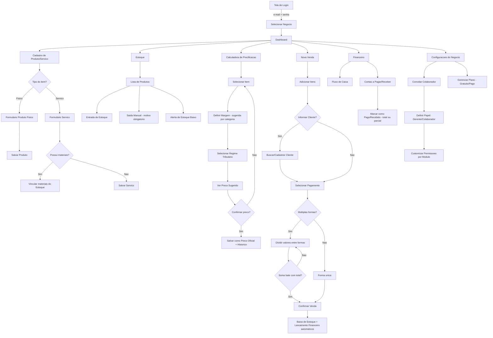
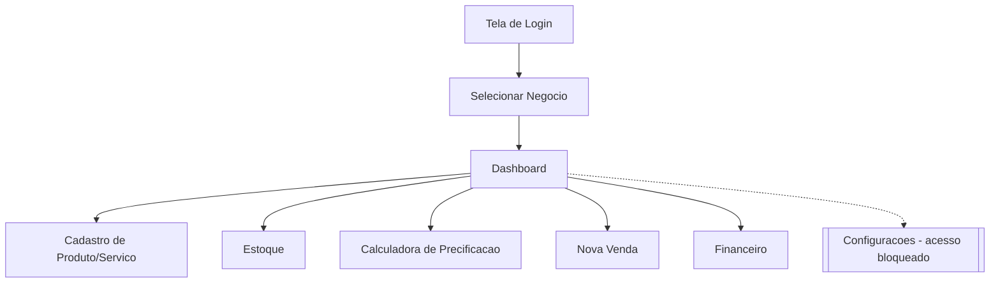
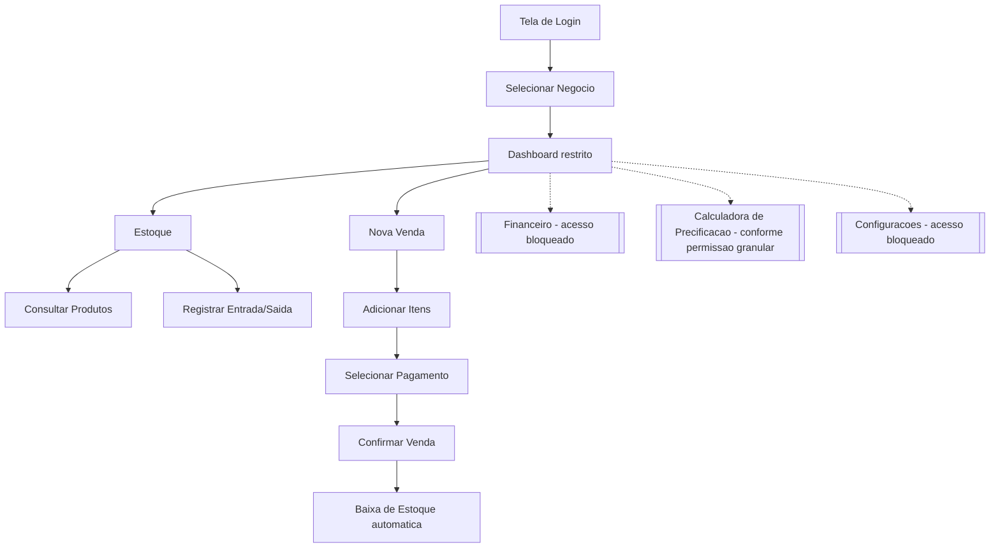
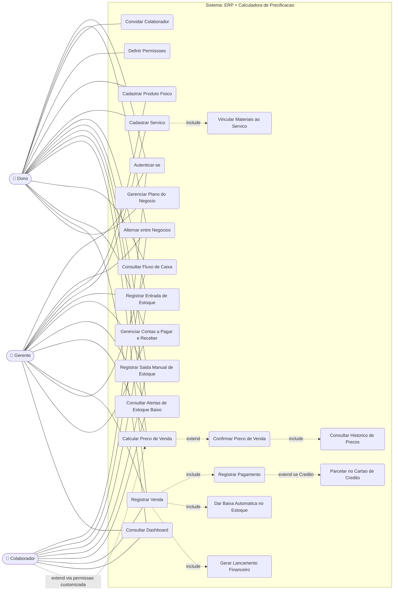

# Fluxogramas — Documento para Leitura por IA

## ERP + Calculadora de Precificação para Microempreendedores e Autônomos

Este arquivo reúne, em texto puro (sintaxe Mermaid), todos os fluxogramas do projeto: as 3 jornadas de usuário (tela a tela, por papel de acesso) e o diagrama de caso de uso. O objetivo é permitir que qualquer IA ou ferramenta leia e interprete os fluxos sem depender de imagem — bastando processar os blocos de código abaixo.

Cada bloco é independente e pode ser renderizado isoladamente em qualquer visualizador Mermaid (ex.: [mermaid.live](https://mermaid.live), GitHub, VS Code com extensão Mermaid).

---

## Jornada do Dono (acesso total)

---

## Jornada do Gerente (acesso total, exceto configurações)

---

## Jornada do Colaborador (Vendas e Estoque, sem Financeiro)

---

## Diagrama de Caso de Uso

---

