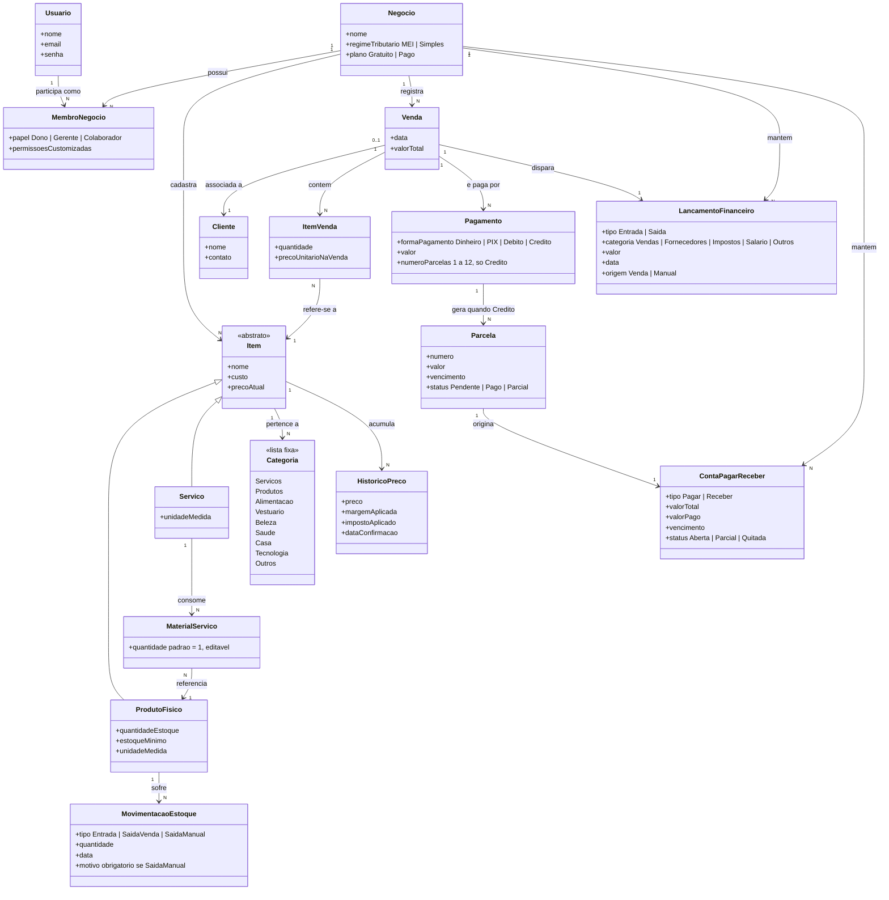
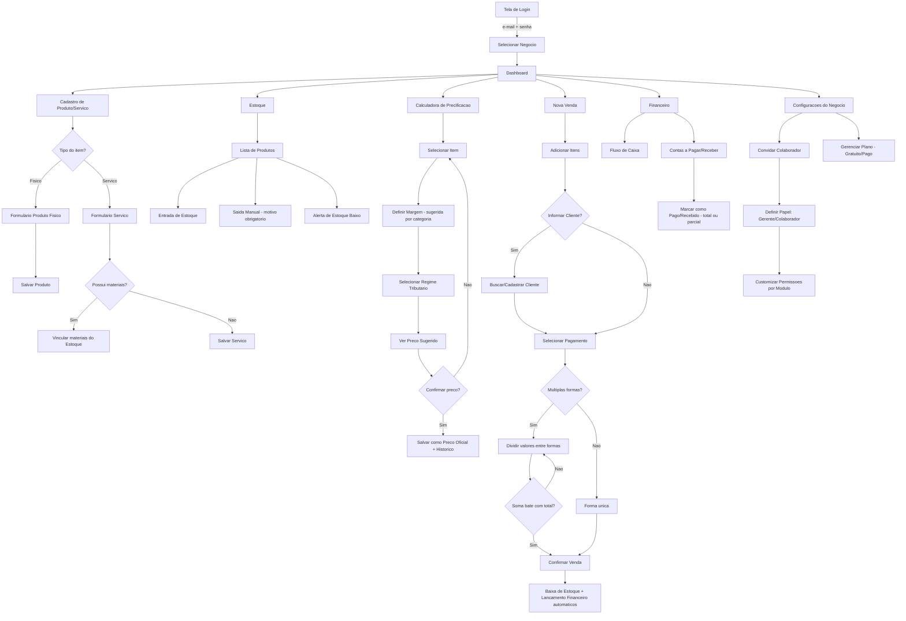
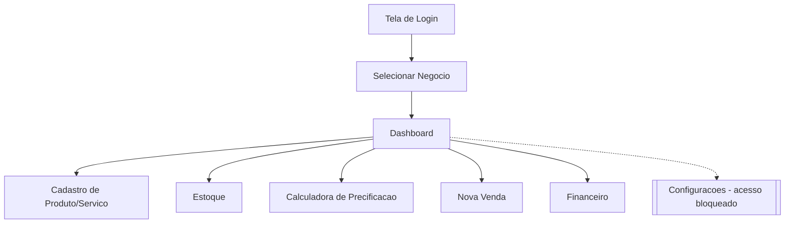
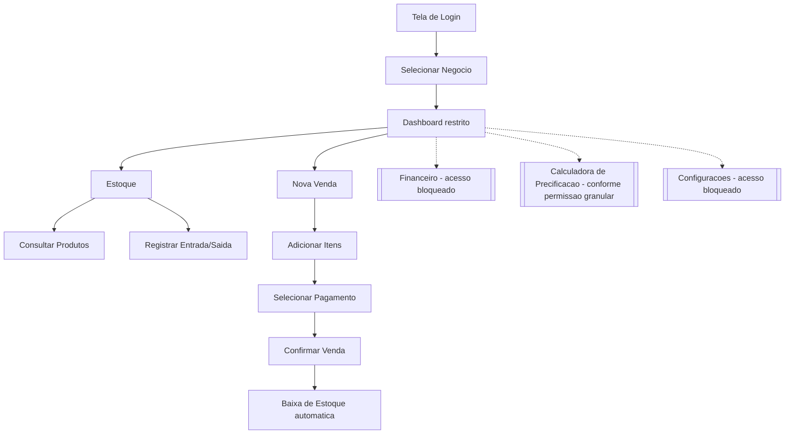

# Modelo de Domínio e Jornadas de Usuário

## ERP + Calculadora de Precificação para Microempreendedores e Autônomos

*Documento complementar — construído a partir dos RF, RNF e Regras de Negócio*

> Este arquivo usa a sintaxe [Mermaid](https://mermaid.js.org/). O GitHub renderiza os diagramas automaticamente ao visualizar o `.md`. Para editar, basta alterar os blocos de código dentro de \`\`\`mermaid \`\`\` — ferramentas como o [Mermaid Live Editor](https://mermaid.live) também permitem visualizar e ajustar antes de commitar.

---

## 1. Diagrama de Domínio

Representa os conceitos centrais do negócio, seus atributos, relacionamentos e cardinalidades — sem qualquer referência a banco de dados, framework ou arquitetura.

### Notas de regras de negócio ligadas ao modelo

| Classe | Regra |
|---|---|
| `ProdutoFisico` | Nasce com `quantidadeEstoque = 0`; a quantidade só é alterada via `MovimentacaoEstoque` (RN03). |
| `MovimentacaoEstoque` | Alerta de estoque baixo só é calculado após o item completar 1 ciclo de Entrada + Saída (RN07). |
| `MaterialServico` | Quantidade sugerida automaticamente como 1, editável pelo usuário (RF13). |
| `HistoricoPreco` | Cada novo registro representa uma confirmação explícita do usuário; o mais recente é o `precoAtual` do `Item` (RN15, RN16). |
| `Pagamento` | Dinheiro/PIX/Débito geram `LancamentoFinanceiro` imediato; Cartão de Crédito gera `Parcela(s)` → `ContaPagarReceber` (RN09, RN10). |
| `Parcela` | Vencimentos gerados mensalmente a partir da data da `Venda`, limitado a 12 parcelas (RF27, RF28). |
| `MembroNegocio` | Isola o acesso: um `Usuario` só enxerga dados dos `Negocio`s onde tem `MembroNegocio` (RN01). |

---

## 2. Jornadas de Usuário (Tela a Tela)

Fluxos de navegação por papel de usuário, com base nas permissões definidas em RF05/RF06.

### 2.1 Jornada — Dono (acesso total)

### 2.2 Jornada — Gerente (acesso total, exceto configurações)

### 2.3 Jornada — Colaborador (Vendas e Estoque, sem Financeiro)

> A Calculadora aparece como bloqueada por padrão para o Colaborador no papel fixo, mas pode ser liberada via permissão granular customizada (RF06).

---

## Próximos ajustes sugeridos

- [ ] Validar se `Cliente` deveria ter campos adicionais (histórico de compras, contato via WhatsApp) para uma futura fase.
- [ ] Confirmar se `LancamentoFinanceiro` deve se relacionar 1:1 ou 1:N com `Venda` (ex.: venda com pagamento misto pode gerar mais de um lançamento imediato).
- [ ] Ajustar a jornada do Colaborador conforme as permissões granulares reais forem desenhadas nas telas.
- [ ] Adicionar jornada de "primeiro acesso" (onboarding) separada, já que ela provavelmente difere do fluxo recorrente mostrado acima.
