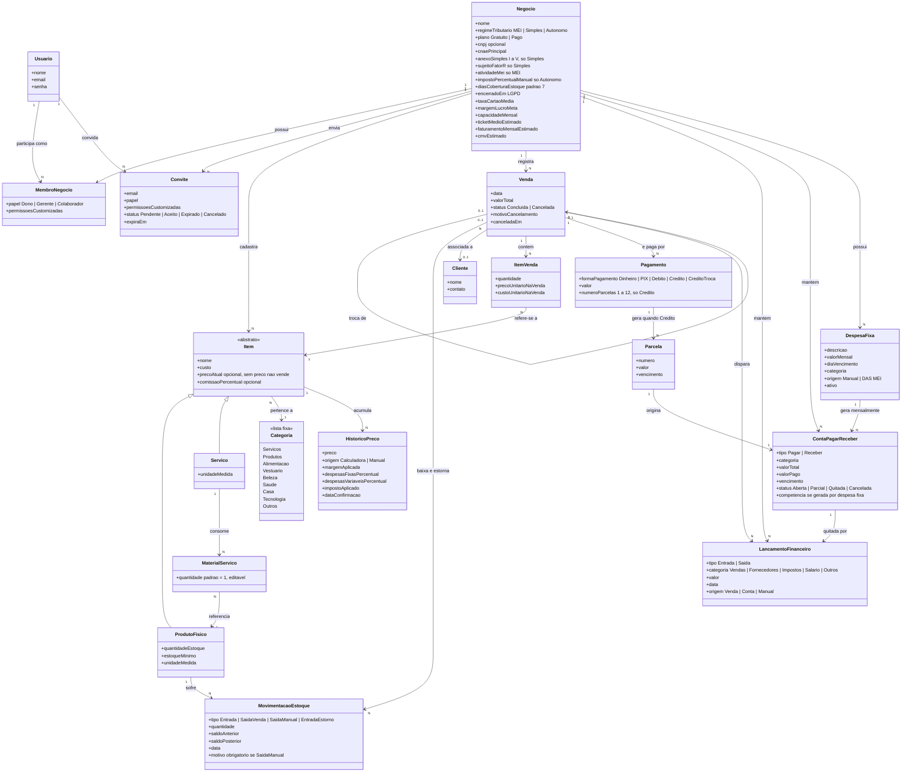
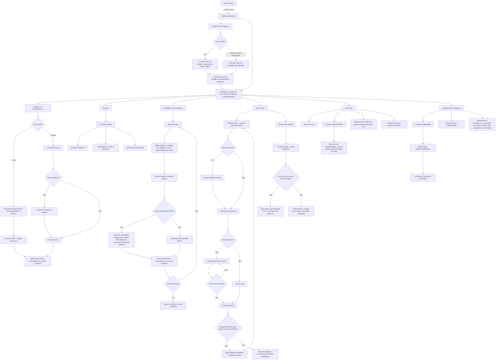
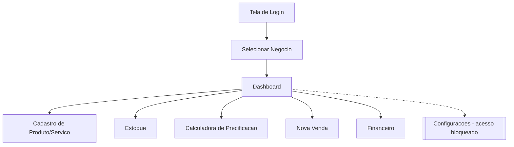
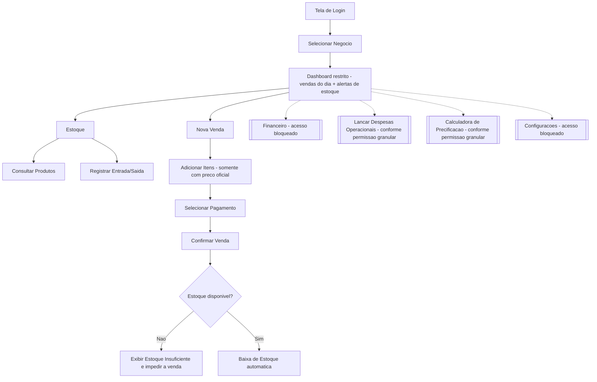

# Modelo de Domínio e Jornadas de Usuário

## ERP + Calculadora de Precificação para Microempreendedores e Autônomos

*Documento complementar — construído a partir dos RF, RNF e Regras de Negócio*

> Este arquivo usa a sintaxe [Mermaid](https://mermaid.js.org/). O GitHub renderiza os diagramas automaticamente ao visualizar o `.md`. Para editar, basta alterar os blocos de código dentro de \`\`\`mermaid \`\`\` — ferramentas como o [Mermaid Live Editor](https://mermaid.live) também permitem visualizar e ajustar antes de commitar.

---

## 1. Diagrama de Domínio

Representa os conceitos centrais do negócio, seus atributos, relacionamentos e cardinalidades — sem qualquer referência a banco de dados, framework ou arquitetura.

```mermaid
classDiagram
    class Negocio {
        +nome
        +regimeTributario  MEI | Simples | Autonomo
        +plano  Gratuito | Pago
        +cnpj  opcional
        +cnaePrincipal
        +anexoSimples  I a V, so Simples
        +sujeitoFatorR  so Simples
        +atividadeMei  so MEI
        +impostoPercentualManual  so Autonomo
        +diasCoberturaEstoque  padrao 7
        +encerradoEm  LGPD
        +taxaCartaoMedia
        +margemLucroMeta
        +capacidadeMensal
        +ticketMedioEstimado
        +faturamentoMensalEstimado
        +cmvEstimado
    }

    class DespesaFixa {
        +descricao
        +valorMensal
        +diaVencimento
        +categoria
        +origem  Manual | DAS MEI
        +ativo
    }

    class Usuario {
        +nome
        +email
        +senha
    }

    class MembroNegocio {
        +papel  Dono | Gerente | Colaborador
        +permissoesCustomizadas
    }

    class Convite {
        +email
        +papel
        +permissoesCustomizadas
        +status  Pendente | Aceito | Expirado | Cancelado
        +expiraEm
    }

    class Categoria {
        <<lista fixa>>
        Servicos
        Produtos
        Alimentacao
        Vestuario
        Beleza
        Saude
        Casa
        Tecnologia
        Outros
    }

    class Item {
        <<abstrato>>
        +nome
        +custo
        +precoAtual  opcional, sem preco nao vende
        +comissaoPercentual  opcional
    }

    class ProdutoFisico {
        +quantidadeEstoque
        +estoqueMinimo
        +unidadeMedida
    }

    class Servico {
        +unidadeMedida
    }

    class MaterialServico {
        +quantidade  padrao = 1, editavel
    }

    class MovimentacaoEstoque {
        +tipo  Entrada | SaidaVenda | SaidaManual | EntradaEstorno
        +quantidade
        +saldoAnterior
        +saldoPosterior
        +data
        +motivo  obrigatorio se SaidaManual
    }

    class HistoricoPreco {
        +preco
        +origem  Calculadora | Manual
        +margemAplicada
        +despesasFixasPercentual
        +despesasVariaveisPercentual
        +impostoAplicado
        +dataConfirmacao
    }

    class Cliente {
        +nome
        +contato
    }

    class Venda {
        +data
        +valorTotal
        +status  Concluida | Cancelada
        +motivoCancelamento
        +canceladaEm
    }

    class ItemVenda {
        +quantidade
        +precoUnitarioNaVenda
        +custoUnitarioNaVenda
    }

    class Pagamento {
        +formaPagamento  Dinheiro | PIX | Debito | Credito | CreditoTroca
        +valor
        +numeroParcelas  1 a 12, so Credito
    }

    class Parcela {
        +numero
        +valor
        +vencimento
    }

    class LancamentoFinanceiro {
        +tipo  Entrada | Saida
        +categoria  Vendas | Fornecedores | Impostos | Salario | Outros
        +valor
        +data
        +origem  Venda | Conta | Manual
    }

    class ContaPagarReceber {
        +tipo  Pagar | Receber
        +categoria
        +valorTotal
        +valorPago
        +vencimento
        +status  Aberta | Parcial | Quitada | Cancelada
        +competencia  se gerada por despesa fixa
    }

    Negocio "1" --> "N" MembroNegocio : possui
    Usuario "1" --> "N" MembroNegocio : participa como
    Negocio "1" --> "N" Convite : envia
    Usuario "1" --> "N" Convite : convida
    Negocio "1" --> "N" Item : cadastra
    Negocio "1" --> "N" Venda : registra
    Negocio "1" --> "N" LancamentoFinanceiro : mantem
    Negocio "1" --> "N" ContaPagarReceber : mantem
    Negocio "1" --> "N" DespesaFixa : possui
    DespesaFixa "1" --> "N" ContaPagarReceber : gera mensalmente
    Venda "0..1" --> "0..1" Venda : troca de

    Item <|-- ProdutoFisico
    Item <|-- Servico
    Item "N" --> "1" Categoria : pertence a
    Item "1" --> "N" HistoricoPreco : acumula

    Servico "1" --> "N" MaterialServico : consome
    MaterialServico "N" --> "1" ProdutoFisico : referencia

    ProdutoFisico "1" --> "N" MovimentacaoEstoque : sofre
    Venda "0..1" --> "N" MovimentacaoEstoque : baixa e estorna

    Venda "N" --> "0..1" Cliente : associada a
    Venda "1" --> "N" ItemVenda : contem
    ItemVenda "N" --> "1" Item : refere-se a
    Venda "1" --> "N" Pagamento : e paga por
    Pagamento "1" --> "N" Parcela : gera quando Credito

    Venda "1" --> "N" LancamentoFinanceiro : dispara
    Parcela "1" --> "1" ContaPagarReceber : origina
    ContaPagarReceber "1" --> "N" LancamentoFinanceiro : quitada por
```

### Notas de regras de negócio ligadas ao modelo

| Classe | Regra |
|---|---|
| `ProdutoFisico` | Nasce com `quantidadeEstoque = 0`; a quantidade só é alterada via `MovimentacaoEstoque` (RN03). |
| `MovimentacaoEstoque` | O mínimo sugerido (e o alerta baseado nele) só é calculado após o item completar 1 ciclo de Entrada + Saída; um mínimo manual alerta desde já (RN07). É o próprio registro de auditoria do estoque: nunca é alterada nem apagada e guarda o saldo antes e depois (RNF05). Baixas e estornos de venda apontam para a `Venda`, e o cancelamento devolve exatamente o que foi baixado (RN25). |
| `MaterialServico` | Quantidade sugerida automaticamente como 1, editável pelo usuário (RF13). |
| `HistoricoPreco` | Cada novo registro representa uma confirmação explícita do usuário; o mais recente é o `precoAtual` do `Item` (RN15, RN16). |
| `Pagamento` | Dinheiro/PIX/Débito geram `LancamentoFinanceiro` imediato; Cartão de Crédito gera `Parcela(s)` → `ContaPagarReceber` (RN09, RN10). |
| `Parcela` | Vencimentos gerados mensalmente a partir da data da `Venda`, limitado a 12 parcelas (RF27, RF28); diferença de centavos na 1ª parcela (RN11). Não tem status próprio: a situação é a da `ContaPagarReceber` (RN22). |
| `ContaPagarReceber` | Cada pagamento/recebimento (total ou parcial) gera um `LancamentoFinanceiro` com a categoria da conta (RN22). |
| `Item.precoAtual` | Opcional; definido por confirmação na Calculadora ou manual, sempre com `HistoricoPreco` (RF64). Item sem preço não pode ser vendido (RN23). |
| `ItemVenda.custoUnitarioNaVenda` | Base do CMV% usado no ponto de equilíbrio e na meta (RF55, RF56, RF62). |
| `Negocio` (dados fiscais) | CNPJ, CNAE e regime obtidos da Receita (RF58); um Anexo do Simples por negócio (RN24); MEI usa DAS como despesa fixa (RF60). |
| `DespesaFixa` | Base de Desp. Fixas% no markup (RF49) e do ponto de equilíbrio/semáforo do Dashboard (RF55–RF57). |
| `Item.comissaoPercentual` | Opcional (padrão 0%); entra como despesa variável junto da taxa média de cartão do `Negocio` (RF51, RF52, RN20). |
| `LancamentoFinanceiro` | Relação 1:N com `Venda`: pagamento misto pode gerar mais de um lançamento imediato. |
| `Venda` | Nunca é apagada; cancelamento muda o status, devolve estoque, cancela contas abertas e estorna o recebido (RN25). Troca gera nova venda ligada à original, paga com crédito de troca limitado ao recebido (RN26). |
| `DespesaFixa` (contas) | Gera uma conta a pagar por mês (competência), sem duplicar; o DAS do MEI é uma despesa fixa mantida pelo sistema (RF60, RF67). |
| `Convite` | O convidado pode ainda não ter conta; ao aceitar, vira `MembroNegocio` com o papel do convite. Convites pendentes contam no limite do plano gratuito (RF72, RF47). |
| `Negocio` (Autônomo) | Autônomo sem CNPJ informa o próprio Imposto% usado na Calculadora (RF59, RF38). |
| `MembroNegocio` | Isola o acesso: um `Usuario` só enxerga dados dos `Negocio`s onde tem `MembroNegocio` (RN01). |

---

## 2. Jornadas de Usuário (Tela a Tela)

Fluxos de navegação por papel de usuário, com base nas permissões definidas em RF05/RF06.

### 2.1 Jornada — Dono (acesso total)

```mermaid
flowchart TD
    A[Tela de Login] -->|e-mail + senha| B[Selecionar Negocio]
    B --> B1[Cadastrar Novo Negocio]
    B1 --> B2{Possui CNPJ?}
    B2 -->|Sim| B3[Consultar CNPJ na Receita - razao social, CNAE, regime]
    B2 -->|Nao ou consulta indisponivel| B4[Preencher regime e atividade manualmente]
    B3 --> B5[Confirmar Anexo do Simples ou atividade MEI sugeridos]
    B4 --> B5
    B5 --> C
    B --> C[Dashboard - resumo do dia, saldo e semaforo de saude financeira]

    C --> D[Cadastro de Produto/Servico]
    D --> D1{Tipo do item?}
    D1 -->|Fisico| D2[Formulario Produto Fisico - sem quantidade em estoque]
    D1 -->|Servico| D3[Formulario Servico]
    D3 --> D4{Possui materiais?}
    D4 -->|Sim| D5[Vincular materiais do Estoque]
    D4 -->|Nao| D6[Salvar Servico]
    D5 --> D6
    D2 --> D7[Salvar Produto - estoque inicial zero]
    D6 --> D8[Definir preco oficial - Calculadora ou manual, opcional]
    D7 --> D8

    C --> E[Estoque]
    E --> E1[Lista de Produtos]
    E1 --> E2[Entrada de Estoque]
    E1 --> E3[Saida Manual - motivo obrigatorio]
    E1 --> E4[Alerta de Estoque Baixo]

    C --> F[Calculadora de Precificacao]
    F --> F1[Selecionar Item]
    F1 --> F2[Definir Margem - sugerida por categoria + aviso: ganho liquido por venda]
    F2 --> F3[Conferir regime e anexo do negocio]
    F3 --> F3a{Possui historico de vendas?}
    F3a -->|Nao| F3b[Informar capacidade mensal, ticket medio e CMV estimado - faturamento estimado editavel]
    F3a -->|Sim| F3c[Usar faturamento medio - RBT12]
    F3b --> F4[Ver Preco Sugerido + detalhamento + ponto de equilibrio]
    F3c --> F4
    F4 --> F5{Confirmar preco?}
    F5 -->|Sim| F6[Salvar como Preco Oficial + Historico]
    F5 -->|Nao| F1

    C --> G[Nova Venda]
    G --> G1[Adicionar Itens - somente com preco oficial]
    G1 --> G2{Informar Cliente?}
    G2 -->|Sim| G3[Buscar/Cadastrar Cliente]
    G2 -->|Nao| G4[Selecionar Pagamento]
    G3 --> G4
    G4 --> G5{Multiplas formas?}
    G5 -->|Sim| G6[Dividir valores entre formas]
    G5 -->|Nao| G7[Forma unica]
    G6 --> G8{Soma bate com total?}
    G8 -->|Nao| G6
    G8 -->|Sim| G9[Confirmar Venda]
    G7 --> G9
    G9 --> G11{Estoque disponivel para todos os itens e materiais?}
    G11 -->|Nao| G12[Exibir Estoque Insuficiente e impedir a venda]
    G12 --> G1
    G11 -->|Sim| G10[Baixa de Estoque + Lancamento Financeiro automaticos]
    G --> G13[Historico de Vendas]
    G13 --> G14[Cancelar Venda - motivo obrigatorio]
    G14 --> G15{Troca por item de valor menor ou igual?}
    G15 -->|Sim| G16[Nova venda com credito de troca + reembolso da diferenca]
    G15 -->|Nao| G17[Estorno total - estoque volta, contas canceladas, reembolso]

    C --> H[Financeiro]
    H --> H1[Fluxo de Caixa]
    H --> H2[Contas a Pagar/Receber]
    H2 --> H3[Marcar como Pago/Recebido - total ou parcial, gera lancamento no caixa]
    H --> H4[Despesas Fixas Mensais - geram contas a pagar todo mes]
    H --> H5[Projecao de Caixa - proximos 6 meses]

    C --> I[Configuracoes do Negocio]
    I --> I1[Convidar Colaborador]
    I1 --> I2[Definir Papel: Gerente/Colaborador]
    I2 --> I3[Customizar Permissoes por Modulo]
    I --> I4[Gerenciar Plano - Gratuito/Pago]
    I --> I5[Parametros de Precificacao - taxa media de cartao, margem meta, capacidade e ticket medio]
```

### 2.2 Jornada — Gerente (acesso total, exceto configurações)

```mermaid
flowchart TD
    A[Tela de Login] --> B[Selecionar Negocio]
    B --> C[Dashboard]
    C --> D[Cadastro de Produto/Servico]
    C --> E[Estoque]
    C --> F[Calculadora de Precificacao]
    C --> G[Nova Venda]
    C --> H[Financeiro]
    C -.-> I[[Configuracoes - acesso bloqueado]]
```

### 2.3 Jornada — Colaborador (Vendas e Estoque, sem Financeiro)

```mermaid
flowchart TD
    A[Tela de Login] --> B[Selecionar Negocio]
    B --> C[Dashboard restrito - vendas do dia + alertas de estoque]
    C --> D[Estoque]
    D --> D1[Consultar Produtos]
    D --> D2[Registrar Entrada/Saida]

    C --> E[Nova Venda]
    E --> E1[Adicionar Itens - somente com preco oficial]
    E1 --> E2[Selecionar Pagamento]
    E2 --> E3[Confirmar Venda]
    E3 --> E5{Estoque disponivel?}
    E5 -->|Nao| E6[Exibir Estoque Insuficiente e impedir a venda]
    E5 -->|Sim| E4[Baixa de Estoque automatica]

    C -.-> F[[Financeiro - acesso bloqueado]]
    C -.-> F1[[Lancar Despesas Operacionais - conforme permissao granular]]
    C -.-> G[[Calculadora de Precificacao - conforme permissao granular]]
    C -.-> H[[Configuracoes - acesso bloqueado]]
```

> A Calculadora e o lançamento de despesas operacionais aparecem como bloqueados por padrão para o Colaborador no papel fixo, mas podem ser liberados via permissão granular customizada (RF06) — sem acesso a saldo, relatórios, custos fixos ou margens.

---

## Próximos ajustes sugeridos

- [ ] Validar se `Cliente` deveria ter campos adicionais (histórico de compras, contato via WhatsApp) para uma futura fase.
- [x] ~~Confirmar se `LancamentoFinanceiro` deve se relacionar 1:1 ou 1:N com `Venda`~~ — definido como 1:N.
- [ ] Ajustar a jornada do Colaborador conforme as permissões granulares reais forem desenhadas nas telas.
- [ ] Adicionar jornada de "primeiro acesso" (onboarding) separada, já que ela provavelmente difere do fluxo recorrente mostrado acima.
