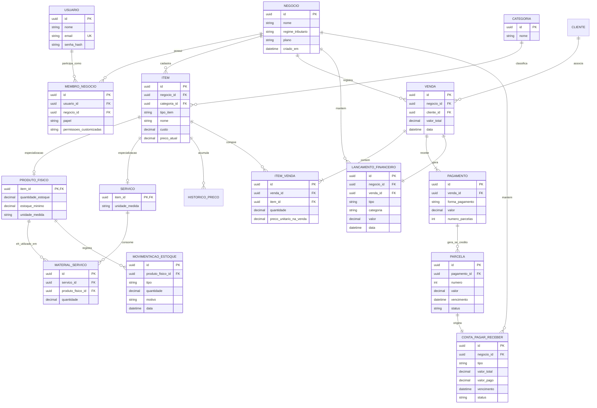

# Modelo Lógico de Banco de Dados (DER) — HE (HealthEnterprise)

Este documento especifica a estrutura relacional do banco de dados (Modelo Lógico) do sistema **HealthEnterprise (HE)**, derivado do Modelo de Domínio Conceitual e preparado para a implementação no Prisma ORM (PostgreSQL).

---

## 📊 Diagrama Entidade-Relacionamento (ER)

> **Dica de Renderização:** O GitHub renderiza o bloco abaixo automaticamente nas páginas do repositório.

---

## 🖼️ Imagem Exportada

