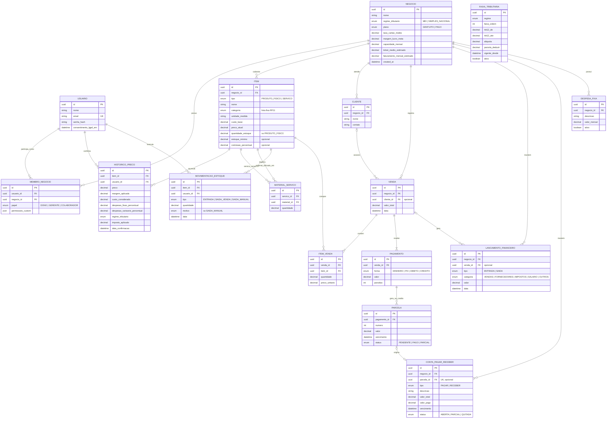

# Modelo Lógico de Banco de Dados (DER) — HE (HealthEnterprise)

Este documento especifica a estrutura relacional do banco de dados (Modelo Lógico) do sistema **HealthEnterprise (HE)**, derivado do Modelo de Domínio Conceitual e preparado para a implementação no Prisma ORM (PostgreSQL).

---

## 📊 Diagrama Entidade-Relacionamento (ER)

> **Dica de Renderização:** O GitHub renderiza o bloco abaixo automaticamente nas páginas do repositório.

```mermaid
erDiagram
    USUARIO ||--o{ MEMBRO_NEGOCIO : "participa_como"
    NEGOCIO ||--o{ MEMBRO_NEGOCIO : "possui"
    NEGOCIO ||--o{ ITEM : "cadastra"
    NEGOCIO ||--o{ CLIENTE : "atende"
    NEGOCIO ||--o{ VENDA : "registra"
    NEGOCIO ||--o{ LANCAMENTO_FINANCEIRO : "mantem"
    NEGOCIO ||--o{ CONTA_PAGAR_RECEBER : "mantem"
    NEGOCIO ||--o{ DESPESA_FIXA : "possui"

    ITEM ||--o{ HISTORICO_PRECO : "acumula"
    USUARIO ||--o{ HISTORICO_PRECO : "confirma"
    ITEM ||--o{ MATERIAL_SERVICO : "servico_consome"
    ITEM ||--o{ MATERIAL_SERVICO : "material_utilizado_em"
    ITEM ||--o{ MOVIMENTACAO_ESTOQUE : "registra"
    USUARIO ||--o{ MOVIMENTACAO_ESTOQUE : "executa"

    CLIENTE |o--o{ VENDA : "associa"
    VENDA ||--|{ ITEM_VENDA : "contem"
    ITEM ||--o{ ITEM_VENDA : "compoe"
    VENDA ||--|{ PAGAMENTO : "recebe"
    VENDA |o--o{ LANCAMENTO_FINANCEIRO : "gera"
    PAGAMENTO ||--o{ PARCELA : "gera_se_credito"
    PARCELA |o--o| CONTA_PAGAR_RECEBER : "origina"

    NEGOCIO {
        uuid id PK
        string nome
        enum regime_tributario "MEI | SIMPLES_NACIONAL"
        enum plano "GRATUITO | PAGO"
        decimal taxa_cartao_media
        decimal margem_lucro_meta
        decimal capacidade_mensal
        decimal ticket_medio_estimado
        decimal faturamento_mensal_estimado
        datetime created_at
    }

    USUARIO {
        uuid id PK
        string nome
        string email UK
        string senha_hash
        datetime consentimento_lgpd_em
    }

    MEMBRO_NEGOCIO {
        uuid id PK
        uuid usuario_id FK
        uuid negocio_id FK
        enum papel "DONO | GERENTE | COLABORADOR"
        json permissoes_custom
    }

    CLIENTE {
        uuid id PK
        uuid negocio_id FK
        string nome
        string contato
    }

    ITEM {
        uuid id PK
        uuid negocio_id FK
        enum tipo "PRODUTO_FISICO | SERVICO"
        string nome
        enum categoria "lista fixa RF11"
        string unidade_medida
        decimal custo_base
        decimal preco_atual
        decimal quantidade_estoque "so PRODUTO_FISICO"
        decimal estoque_minimo "opcional"
        decimal comissao_percentual "opcional"
    }

    MATERIAL_SERVICO {
        uuid id PK
        uuid servico_id FK
        uuid material_id FK
        decimal quantidade
    }

    MOVIMENTACAO_ESTOQUE {
        uuid id PK
        uuid item_id FK
        uuid usuario_id FK
        enum tipo "ENTRADA | SAIDA_VENDA | SAIDA_MANUAL"
        decimal quantidade
        enum motivo "so SAIDA_MANUAL"
        datetime data
    }

    HISTORICO_PRECO {
        uuid id PK
        uuid item_id FK
        uuid usuario_id FK
        decimal preco
        decimal margem_aplicada
        decimal custo_considerado
        decimal despesas_fixas_percentual
        decimal despesas_variaveis_percentual
        enum regime_tributario
        decimal imposto_aplicado
        datetime data_confirmacao
    }

    FAIXA_TRIBUTARIA {
        uuid id PK
        enum regime
        int faixa_ordem
        decimal rbt12_de
        decimal rbt12_ate
        decimal aliquota
        decimal parcela_deduzir
        datetime vigente_desde
        boolean ativo
    }

    DESPESA_FIXA {
        uuid id PK
        uuid negocio_id FK
        string descricao
        decimal valor_mensal
        boolean ativo
    }

    VENDA {
        uuid id PK
        uuid negocio_id FK
        uuid cliente_id FK "opcional"
        decimal valor_total
        datetime data
    }

    ITEM_VENDA {
        uuid id PK
        uuid venda_id FK
        uuid item_id FK
        decimal quantidade
        decimal preco_unitario
    }

    PAGAMENTO {
        uuid id PK
        uuid venda_id FK
        enum forma "DINHEIRO | PIX | DEBITO | CREDITO"
        decimal valor
        int parcelas
    }

    PARCELA {
        uuid id PK
        uuid pagamento_id FK
        int numero
        decimal valor
        datetime vencimento
        enum status "PENDENTE | PAGO | PARCIAL"
    }

    LANCAMENTO_FINANCEIRO {
        uuid id PK
        uuid negocio_id FK
        uuid venda_id FK "opcional"
        enum tipo "ENTRADA | SAIDA"
        enum categoria "VENDAS | FORNECEDORES | IMPOSTOS | SALARIO | OUTROS"
        decimal valor
        datetime data
    }

    CONTA_PAGAR_RECEBER {
        uuid id PK
        uuid negocio_id FK
        uuid parcela_id FK "UK, opcional"
        enum tipo "PAGAR | RECEBER"
        string descricao
        decimal valor_total
        decimal valor_pago
        datetime vencimento
        enum status "ABERTA | PARCIAL | QUITADA"
    }
```

### Decisões de modelagem (alinhadas ao `schema.prisma`, que é a fonte da verdade)

| Decisão | Justificativa |
|---|---|
| `ITEM` em tabela única com coluna `tipo` (sem tabelas `PRODUTO_FISICO`/`SERVICO`) | Simplifica consultas de catálogo e vendas; campos de estoque só são válidos quando `tipo = PRODUTO_FISICO` (RN04, validado na aplicação). |
| `categoria` como enum (sem tabela `CATEGORIA`) | A lista de categorias é fixa do sistema (RF11). |
| `MATERIAL_SERVICO` referencia `ITEM` duas vezes | `servico_id` aponta para um item `SERVICO` e `material_id` para um item `PRODUTO_FISICO` (RF12). |
| `VENDA` 1:N `LANCAMENTO_FINANCEIRO` | Pagamento misto pode gerar mais de um lançamento imediato (RN09). |
| `PARCELA` 1:1 `CONTA_PAGAR_RECEBER` | Cada parcela de cartão gera sua própria conta a receber com vencimento mensal (RN10, RF28). |
| Status "Atrasada" não persistido | É derivado: `vencimento < hoje` e `valor_pago < valor_total`. |
| `DESPESA_FIXA` + parâmetros no `NEGOCIO` | Base do markup completo (RF34, RF48–RF51) e do ponto de equilíbrio/semáforo (RF55–RF57). |

---

## 🖼️ Imagem Exportada
> ⚠️ A imagem abaixo foi exportada antes da revisão v3 e está **desatualizada** em relação ao diagrama acima (ainda mostra `PRODUTO_FISICO`, `SERVICO` e `CATEGORIA` como tabelas). Deve ser regerada a partir do bloco Mermaid.

