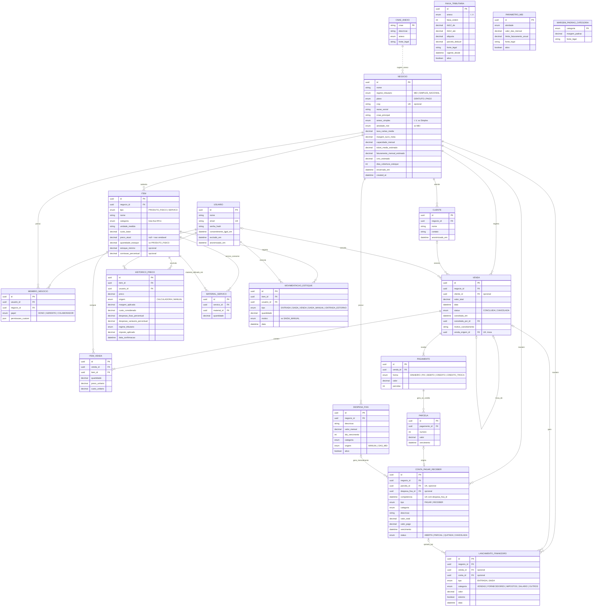

# Modelo Lógico de Banco de Dados (DER) — HE (HealthEnterprise)

Este documento especifica a estrutura relacional do banco de dados (Modelo Lógico) do sistema **HealthEnterprise (HE)**, derivado do Modelo de Domínio Conceitual e preparado para a implementação no Prisma ORM (PostgreSQL).

---

## 📊 Diagrama Entidade-Relacionamento (ER)

> **Dica de Renderização:** O GitHub renderiza o bloco abaixo automaticamente nas páginas do repositório.

```mermaid
erDiagram
    USUARIO ||--o{ MEMBRO_NEGOCIO : "participa_como"
    NEGOCIO ||--o{ MEMBRO_NEGOCIO : "possui"
    NEGOCIO ||--o{ ITEM : "cadastra"
    NEGOCIO ||--o{ CLIENTE : "atende"
    NEGOCIO ||--o{ VENDA : "registra"
    NEGOCIO ||--o{ LANCAMENTO_FINANCEIRO : "mantem"
    NEGOCIO ||--o{ CONTA_PAGAR_RECEBER : "mantem"
    NEGOCIO ||--o{ DESPESA_FIXA : "possui"

    ITEM ||--o{ HISTORICO_PRECO : "acumula"
    USUARIO ||--o{ HISTORICO_PRECO : "confirma"
    ITEM ||--o{ MATERIAL_SERVICO : "servico_consome"
    ITEM ||--o{ MATERIAL_SERVICO : "material_utilizado_em"
    ITEM ||--o{ MOVIMENTACAO_ESTOQUE : "registra"
    USUARIO ||--o{ MOVIMENTACAO_ESTOQUE : "executa"

    CLIENTE |o--o{ VENDA : "associa"
    VENDA ||--|{ ITEM_VENDA : "contem"
    ITEM ||--o{ ITEM_VENDA : "compoe"
    VENDA ||--|{ PAGAMENTO : "recebe"
    VENDA |o--o{ LANCAMENTO_FINANCEIRO : "gera"
    PAGAMENTO ||--o{ PARCELA : "gera_se_credito"
    PARCELA |o--o| CONTA_PAGAR_RECEBER : "origina"
    CONTA_PAGAR_RECEBER |o--o{ LANCAMENTO_FINANCEIRO : "quitada_por"
    CNAE_ANEXO ||..o{ NEGOCIO : "sugere_anexo"
    DESPESA_FIXA |o--o{ CONTA_PAGAR_RECEBER : "gera_mensalmente"
    VENDA |o--o| VENDA : "troca_de"
    USUARIO |o--o{ VENDA : "cancela"

    NEGOCIO {
        uuid id PK
        string nome
        enum regime_tributario "MEI | SIMPLES_NACIONAL"
        enum plano "GRATUITO | PAGO"
        string cnpj UK "opcional"
        string razao_social
        string cnae_principal
        enum anexo_simples "I..V, so Simples"
        enum atividade_mei "so MEI"
        decimal taxa_cartao_media
        decimal margem_lucro_meta
        decimal capacidade_mensal
        decimal ticket_medio_estimado
        decimal faturamento_mensal_estimado
        decimal cmv_estimado
        int dias_cobertura_estoque
        datetime encerrado_em
        datetime created_at
    }

    USUARIO {
        uuid id PK
        string nome
        string email UK
        string senha_hash
        datetime consentimento_lgpd_em
        datetime excluido_em
        datetime anonimizado_em
    }

    MEMBRO_NEGOCIO {
        uuid id PK
        uuid usuario_id FK
        uuid negocio_id FK
        enum papel "DONO | GERENTE | COLABORADOR"
        json permissoes_custom
    }

    CLIENTE {
        uuid id PK
        uuid negocio_id FK
        string nome
        string contato
        datetime anonimizado_em
    }

    ITEM {
        uuid id PK
        uuid negocio_id FK
        enum tipo "PRODUTO_FISICO | SERVICO"
        string nome
        enum categoria "lista fixa RF11"
        string unidade_medida
        decimal custo_base
        decimal preco_atual "null = nao vendavel"
        decimal quantidade_estoque "so PRODUTO_FISICO"
        decimal estoque_minimo "opcional"
        decimal comissao_percentual "opcional"
    }

    MATERIAL_SERVICO {
        uuid id PK
        uuid servico_id FK
        uuid material_id FK
        decimal quantidade
    }

    MOVIMENTACAO_ESTOQUE {
        uuid id PK
        uuid item_id FK
        uuid usuario_id FK
        enum tipo "ENTRADA | SAIDA_VENDA | SAIDA_MANUAL | ENTRADA_ESTORNO"
        decimal quantidade
        enum motivo "so SAIDA_MANUAL"
        datetime data
    }

    HISTORICO_PRECO {
        uuid id PK
        uuid item_id FK
        uuid usuario_id FK
        decimal preco
        enum origem "CALCULADORA | MANUAL"
        decimal margem_aplicada
        decimal custo_considerado
        decimal despesas_fixas_percentual
        decimal despesas_variaveis_percentual
        enum regime_tributario
        decimal imposto_aplicado
        datetime data_confirmacao
    }

    FAIXA_TRIBUTARIA {
        uuid id PK
        enum anexo "I..V"
        int faixa_ordem
        decimal rbt12_de
        decimal rbt12_ate
        decimal aliquota
        decimal parcela_deduzir
        string fonte_legal
        datetime vigente_desde
        boolean ativo
    }

    CNAE_ANEXO {
        string cnae PK
        string descricao
        enum anexo
        string fonte_legal
    }

    PARAMETRO_MEI {
        uuid id PK
        enum atividade
        decimal valor_das_mensal
        decimal limite_faturamento_anual
        string fonte_legal
        boolean ativo
    }

    MARGEM_PADRAO_CATEGORIA {
        enum categoria PK
        decimal margem_padrao
        string fonte_legal
    }

    DESPESA_FIXA {
        uuid id PK
        uuid negocio_id FK
        string descricao
        decimal valor_mensal
        int dia_vencimento
        enum categoria
        enum origem "MANUAL | DAS_MEI"
        boolean ativo
    }

    VENDA {
        uuid id PK
        uuid negocio_id FK
        uuid cliente_id FK "opcional"
        decimal valor_total
        datetime data
        enum status "CONCLUIDA | CANCELADA"
        datetime cancelada_em
        uuid cancelada_por_id FK
        string motivo_cancelamento
        uuid venda_origem_id FK "UK, troca"
    }

    ITEM_VENDA {
        uuid id PK
        uuid venda_id FK
        uuid item_id FK
        decimal quantidade
        decimal preco_unitario
        decimal custo_unitario
    }

    PAGAMENTO {
        uuid id PK
        uuid venda_id FK
        enum forma "DINHEIRO | PIX | DEBITO | CREDITO | CREDITO_TROCA"
        decimal valor
        int parcelas
    }

    PARCELA {
        uuid id PK
        uuid pagamento_id FK
        int numero
        decimal valor
        datetime vencimento
    }

    LANCAMENTO_FINANCEIRO {
        uuid id PK
        uuid negocio_id FK
        uuid venda_id FK "opcional"
        uuid conta_id FK "opcional"
        enum tipo "ENTRADA | SAIDA"
        enum categoria "VENDAS | FORNECEDORES | IMPOSTOS | SALARIO | OUTROS"
        decimal valor
        boolean estorno
        datetime data
    }

    CONTA_PAGAR_RECEBER {
        uuid id PK
        uuid negocio_id FK
        uuid parcela_id FK "UK, opcional"
        uuid despesa_fixa_id FK "opcional"
        datetime competencia "UK com despesa_fixa_id"
        enum tipo "PAGAR | RECEBER"
        enum categoria
        string descricao
        decimal valor_total
        decimal valor_pago
        datetime vencimento
        enum status "ABERTA | PARCIAL | QUITADA | CANCELADA"
    }
```

### Decisões de modelagem (alinhadas ao `schema.prisma`, que é a fonte da verdade)

| Decisão | Justificativa |
|---|---|
| `ITEM` em tabela única com coluna `tipo` (sem tabelas `PRODUTO_FISICO`/`SERVICO`) | Simplifica consultas de catálogo e vendas; campos de estoque só são válidos quando `tipo = PRODUTO_FISICO` (RN04, validado na aplicação). |
| `categoria` como enum (sem tabela `CATEGORIA`) | A lista de categorias é fixa do sistema (RF11). |
| `MATERIAL_SERVICO` referencia `ITEM` duas vezes | `servico_id` aponta para um item `SERVICO` e `material_id` para um item `PRODUTO_FISICO` (RF12). |
| `VENDA` 1:N `LANCAMENTO_FINANCEIRO` | Pagamento misto pode gerar mais de um lançamento imediato (RN09). |
| `PARCELA` 1:1 `CONTA_PAGAR_RECEBER` | Cada parcela de cartão gera sua própria conta a receber com vencimento mensal (RN10, RF28). A parcela não tem status próprio: a situação é o status da conta (RN22). |
| `VENDA.status` + `VENDA.venda_origem_id` | Venda nunca é apagada; cancelamento muda o status (RN25) e a troca gera nova venda ligada à original (RF66, RN26). |
| `DESPESA_FIXA` 1:N `CONTA_PAGAR_RECEBER` | Uma conta a pagar por mês (`competencia`), com unicidade `(despesa_fixa_id, competencia)` (RF67). |
| Campos `excluido_em` / `anonimizado_em` / `encerrado_em` | Exclusão de conta por anonimização com retenção fiscal de 5 anos (RN27). |
| `CONTA_PAGAR_RECEBER` 1:N `LANCAMENTO_FINANCEIRO` | Cada pagamento/recebimento (total ou parcial) gera um lançamento no caixa (RN22, RN14). |
| `ITEM.preco_atual` opcional + `HISTORICO_PRECO.origem` | Preço nasce de confirmação via Calculadora ou manual (RF64); item sem preço não é vendável (RN23). |
| `ITEM_VENDA.custo_unitario` | Custo gravado na venda para apurar o CMV% (RF62) usado no PE e na Meta (RF55, RF56). |
| Tabelas de parâmetros fiscais (`FAIXA_TRIBUTARIA`, `CNAE_ANEXO`, `PARAMETRO_MEI`, `MARGEM_PADRAO_CATEGORIA`) | Valores oficiais parametrizáveis com fonte legal e vigência, sem `negocio_id` (globais do sistema) — RN17, RF36, RF59, RF60. |
| Status "Atrasada" não persistido | É derivado: `vencimento < hoje` e `valor_pago < valor_total`. |
| `DESPESA_FIXA` + parâmetros no `NEGOCIO` | Base do markup completo (RF34, RF48–RF51) e do ponto de equilíbrio/semáforo (RF55–RF57). |

---

## 🖼️ Imagem Exportada
> Imagem gerada a partir do bloco Mermaid acima. Ao alterar o diagrama, regere a imagem (ex.: `npx @mermaid-js/mermaid-cli -i diagrama.mmd -o ../img/modelo_logico_bd.png`).

